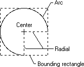
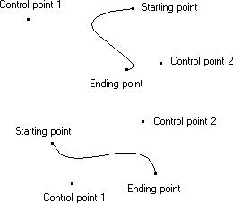

# Curves

A regular curve is a set of highlighted pixels on a raster display (or dots on a printed page) that define the perimeter (or part of the perimeter) of a conic section. An irregular curve is a set of pixels that define a curve that does not fit the perimeter of a conic section. The ending point is excluded from a curve just as it is excluded from a line.

When an application calls one of the curve-drawing functions, GDI breaks the curve into a number of extremely small, discrete line segments. After determining the endpoints (starting point and ending point) for each of these line segments, GDI determines which pixels (or dots) define each line by applying its DDA.

An application can draw an ellipse or part of an ellipse by calling the [**Arc**](/windows/desktop/api/Wingdi/nf-wingdi-arc) function. This function draws the curve within the perimeter of an invisible rectangle called a bounding rectangle. The size of the ellipse is specified by two invisible radials extending from the center of the rectangle to the sides of the rectangle. The following illustration shows an arc (part of an ellipse) drawn by using the **Arc** function.

When calling the [**Arc**](/windows/desktop/api/Wingdi/nf-wingdi-arc) function, an application specifies the coordinates of the bounding rectangle and radials. The preceding illustration shows the rectangle and radials with dashed lines while the actual arc was drawn using a solid line.

When drawing the arc of another object, the application can call the [**SetArcDirection**](/windows/desktop/api/Wingdi/nf-wingdi-setarcdirection) and [**GetArcDirection**](/windows/desktop/api/Wingdi/nf-wingdi-getarcdirection) functions to control the direction (clockwise or counterclockwise) in which the object is drawn. The default direction for drawing arcs and other objects is counterclockwise.

In addition to drawing ellipses or parts of ellipses, applications can draw irregular curves called Bézier curves. A *Bézier curve* is an irregular curve whose curvature is defined by four control points (p1, p2, p3, and p4). The control points p1 and p4 define the starting and ending points of the curve, and the control points p2 and p3 define the shape of the curve by marking points where the curve reverses orientation, as shown in the following diagram.

An application can draw irregular curves by calling the [**PolyBezier**](/windows/desktop/api/Wingdi/nf-wingdi-polybezier) function, supplying the appropriate control points.

 

 

