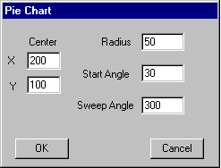
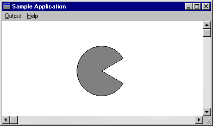

# Drawing a Pie Chart

You can use the line and curve functions to draw a pie chart. The primary function used to draw pie charts is the [**AngleArc**](/windows/desktop/api/Wingdi/nf-wingdi-anglearc) function, which requires you to supply the coordinates of the center of the pie, the radius of the pie, a start angle, and a sweep angle. The following screen shot shows a dialog box that the user can use to enter these values.



The values shown above produce the following pie chart.



The dialog box template found in the application's resource script (.RC) file specifies characteristics of the preceding dialog box (its height, the controls it contains, and its style), as follows.


```C++
AngleArc DIALOG 6, 18, 160, 100 
STYLE WS_DLGFRAME | WS_POPUP | WS_VISIBLE | WS_CAPTION 
CAPTION "Pie Chart" 
FONT 8, "MS Sans Serif" 
BEGIN 
    EDITTEXT   IDD_X, 18, 22, 25, 12, ES_AUTOHSCROLL 
    LTEXT      "X", 102, 4, 24, 9, 8 
    EDITTEXT   IDD_Y, 18, 39, 25, 12, ES_AUTOHSCROLL 
    LTEXT      "Y", 104, 5, 42, 12, 8 
    LTEXT      "Center", 105, 19, 11, 23, 8 
    EDITTEXT   IDD_RADIUS, 103, 9, 32, 12, ES_AUTOHSCROLL 
    EDITTEXT   IDD_STARTANGLE, 103, 31, 32, 12, ES_AUTOHSCROLL 
    EDITTEXT   IDD_SWEEPANGLE, 103, 53, 32, 12, ES_AUTOHSCROLL 
    LTEXT      "Radius", 109, 73, 11, 25, 8 
    LTEXT      "Start Angle", 110, 59, 33, 42, 8 
    LTEXT      "Sweep Angle", 111, 55, 55, 43, 8 
    PUSHBUTTON "OK", IDD_OK, 9, 82, 40, 14 
    PUSHBUTTON "Cancel", IDD_CANCEL, 110, 82, 40, 14 
END 
```


The dialog box procedure, found in the application's source file, retrieves data (center coordinates, arc radius, and start and sweep angles) by following these steps:

1.  The application-defined ClearBits function initializes the array that receives the user-input to zero.
2.  The application-defined GetStrLngth function retrieves the length of the string entered by the user.
3.  The application-defined RetrieveInput function retrieves the value entered by the user.

The following sample code shows the dialog box procedure.


```C++
void ClearBits(LPTSTR, int); 
int GetStrLngth(LPTSTR); 
DWORD RetrieveInput(LPTSTR, int); 

BOOL CALLBACK ArcDlgProc(HWND hdlg, UINT uMsg, WPARAM wParam, 
LPARAM lParam) 
{ 
    CHAR chInput[4];    // receives control-window input  
    int cch;            // array-size and count variable  
 
    switch (uMsg) 
    { 
        case WM_INITDIALOG: 
            return FALSE; 
 
        case WM_COMMAND: 
            switch (wParam)
            { 
                // If the user pressed the OK button, retrieve the  
                // data that was entered in the various AngleArc  
                // controls.  
 
                case IDD_OK: 
                    // Retrieve the x-coordinate of the arc's center.  
 
                    ClearBits(chInput, sizeof(chInput)); 
                    GetDlgItemText(hdlg, IDD_X, chInput, 
                        sizeof(chInput)); 
                    cch = GetStrLngth(chInput); 
                    nX = (int)RetrieveInput(chInput, cch); 
 
                    // Retrieve the y-coordinate of the arc's center.  
 
                    ClearBits(chInput, sizeof(chInput)); 
                    GetDlgItemText(hdlg, IDD_Y, chInput, 
                        sizeof(chInput)); 
                    cch = GetStrLngth(chInput); 
                    nY = (int)RetrieveInput(chInput, cch); 
 
                    // Retrieve the radius of the arc.  
 
                    ClearBits(chInput, sizeof(chInput)); 
                    GetDlgItemText(hdlg, IDD_RADIUS, chInput, 
                        sizeof(chInput)); 
                    cch = GetStrLngth(chInput); 
                    dwRadius = (DWORD) RetrieveInput(chInput, cch); 
 
                    // Retrieve the start angle.  
 
                    ClearBits(chInput, sizeof(chInput)); 
                    GetDlgItemText(hdlg, IDD_STARTANGLE, chInput, 
                        sizeof(chInput)); 
                    cch = GetStrLngth(chInput); 
                    xStartAngle = (float) RetrieveInput(chInput, cch); 
 
                    // Retrieve the sweep angle.  
 
                    ClearBits(chInput, sizeof(chInput)); 
                    GetDlgItemText(hdlg, IDD_SWEEPANGLE, chInput, 
                        sizeof(chInput)); 
                    cch = GetStrLngth(chInput); 
                    xSweepAngle = (float) RetrieveInput(chInput, cch); 
 
                    EndDialog(hdlg, FALSE); 
                    return TRUE; 
 
                // If user presses the CANCEL button, close the  
                // dialog box.  
 
                case IDD_CANCEL: 
                    EndDialog(hdlg, FALSE); 
                    return TRUE; 
            } // end switch (wParam)  
 
            break; 
 
        default: 
            return FALSE; 
    } // end switch (message)  
 
    UNREFERENCED_PARAMETER(lParam); 
} 
 
 
void ClearBits(LPTSTR cArray, int iLength) 
{ 
    int i; 
 
    for (i = 0; i < iLength; i++) 
        cArray[i] = 0; 
} 
 
int GetStrLngth(LPTSTR cArray) 
{ 
    int i = 0; 
 
    while (cArray[i++] != 0); 
        return i - 1; 
} 
 
DWORD RetrieveInput(LPTSTR cArray, int iLength) 
{ 
    int i, iTmp; 
    double dVal, dCount; 
 
    dVal = 0.0; 
    dCount = (double) (iLength - 1); 
 
    // Convert ASCII input to a floating-point value.  
 
    for (i = 0; i < iLength; i++) 
    { 
        iTmp = cArray[i] - 0x30; 
        dVal = dVal + (((double)iTmp) * pow(10.0, dCount--)); 
    } 
 
    return (DWORD) dVal; 
} 
```


To draw each section of the pie chart, pass the values entered by the user to the [**AngleArc**](/windows/desktop/api/Wingdi/nf-wingdi-anglearc) function. To fill the pie chart using the current brush, embed the call to **AngleArc** in a path bracket. The following code sample shows the defined path bracket and the call to **AngleArc**.


```C++
    int nX; 
    int nY; 
    DWORD dwRadius; 
    float xStartAngle; 
    float xSweepAngle; 
 
    hdc = GetDC(hwnd); 
    BeginPath(hdc); 
    SelectObject(hdc, GetStockObject(GRAY_BRUSH)); 
    MoveToEx(hdc, nX, nY, (LPPOINT) NULL); 
    AngleArc(hdc, nX, nY, dwRadius, xStartAngle, xSweepAngle); 
    LineTo(hdc, nX, nY); 
    EndPath(hdc); 
    StrokeAndFillPath(hdc); 
    ReleaseDC(hwnd, hdc); 
```


 

 


