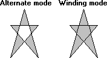

# Filling Regions

An application fills the interior of a region by calling the [**FillRgn**](/windows/desktop/api/Wingdi/nf-wingdi-fillrgn) function and supplying a handle that identifies a specific brush. When an application calls FillRgn , the system fills the region with the brush by using the current fill mode for the specified device context. There are two fill modes: alternate and winding. The application can set the fill mode for a device context by calling the [**SetPolyFillMode**](/windows/desktop/api/Wingdi/nf-wingdi-setpolyfillmode) function. The application can retrieve the current fill mode for a device context by calling the [**GetPolyFillMode**](/windows/desktop/api/Wingdi/nf-wingdi-getpolyfillmode) function.

The following illustration shows two identical regions: one filled using alternate mode and the other filled using winding mode.

## Alternate Mode

To determine which pixels the system highlights when alternate mode is specified, perform the following test:

1.  Select a pixel within the region's interior.
2.  Draw an imaginary ray, in the positive x-direction, from that pixel toward infinity.
3.  Each time the ray intersects a boundary line, increment a count value.

The system highlights the pixel if the count value is an odd number.

## Winding Mode

To determine which pixels the system highlights when winding mode is specified, perform the following test:

1.  Determine the direction in which each boundary line is drawn.
2.  Select a pixel within the region's interior.
3.  Draw an imaginary ray, in the positive x-direction, from the pixel toward infinity.
4.  Each time the ray intersects a boundary line with a positive y-component, increment a count value. Each time the ray intersects a boundary line with a negative y-component, decrement the count value.

The system highlights the pixel if the count value is nonzero.

 

 

