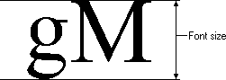

# Font Elements

A *font* is a collection of characters and symbols that share a common design. The three major elements of this design are referred to as typeface, style, and size.

## Typeface

The term typeface refers to specific characteristics of characters and symbols in the font, such as the width of the thick and thin strokes that compose the characters and the presence or absence of serifs. A serif is the short cross line at the ends of an unconnected stroke. A font or typeface without serifs is usually called a sans-serif font.

## Style

The term style refers to the weight and slant of a font. Font weights can range from thin to black. The following is a list of possible weights for fonts (from lightest to heaviest):

<dl> Thin  
Extralight  
Light  
Normal  
Medium  
Semibold  
Bold  
Extrabold  
Heavy  
</dl>

Three terms categorize the slant of a font: roman, oblique, and italic.

The characters in a roman font are upright. The characters in an oblique font are artificially slanted. The slant is achieved by performing a shear transformation on the characters from a roman font. The characters in an italic font are truly slanted and appear as they were designed. For more information on shearing, see [Coordinate Spaces and Transformations](coordinate-spaces-and-transformations.md).

## Size

The *font size* is an imprecise value. It can generally be determined by measuring the distance from the bottom of a lowercase g to the top of an adjacent uppercase M, as shown in the following illustration.

A font's size is specified in units called points. A point is .013837 of an inch. Following the point system devised by Pierre Simon Fournier, it is common practice to approximate a point as 1/72 inch.

 

 

