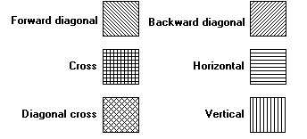

# Hatch Brush

There are six predefined logical hatch brushes maintained by GDI. The following rectangles were painted by using the six predefined hatch brushes.

An application can create a hatch brush by calling the [**CreateHatchBrush**](/windows/win32/Wingdi/nf-wingdi-createhatchbrush?branch=master) function, specifying one of the six hatch styles.

 

 

