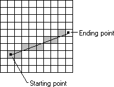
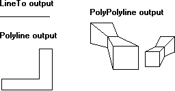

# Lines

A line is a set of highlighted pixels on a raster display (or a set of dots on a printed page) identified by two points: a starting point and an ending point. The pixel located at the starting point is always included in the line, and the pixel located at the ending point is always excluded. (This kind of line is sometimes called inclusive-exclusive.)

When an application calls one of the line-drawing functions, graphics device interface (GDI), or in some cases a device driver, determines which pixels should be highlighted. GDI is a dynamic-link library (DLL) that processes graphics function calls from an application and passes those calls to a device driver. A device driver is a DLL that receives input from GDI, converts the input to device commands, and passes those commands to the appropriate device. GDI uses a digital differential analyzer (DDA) to determine the set of pixels that define a line. A DDA determines the set of pixels by examining each point on the line and identifying those pixels on the display surface (or dots on a printed page) that correspond to the points. The following illustration shows a line, its starting point, its ending point, and the pixels highlighted by using a simple DDA.

The simplest and most common DDA is the Bresenham, or incremental, DDA. A modified version of this algorithm draws lines in Windows. The incremental DDA is noted for its simplicity, but it is also noted for its inaccuracy. Because it rounds off to the nearest integer value, it sometimes fails to represent the original line requested by the application. The DDA used by GDI does not round off to the nearest integer. As a result, this new DDA produces output that is sometimes much closer in appearance to the original line requested by the application.

> [!Note]  
> If an application requires line output that cannot be achieved with the new DDA, it can draw its own lines by calling the [**LineDDA**](/windows/desktop/api/Wingdi/nf-wingdi-linedda) function and supplying a private DDA ([**LineDDAProc**](/windows/desktop/api/Wingdi/nc-wingdi-lineddaproc)). However, the **LineDDA** function draws lines much slower than the line-drawing functions. Do not use this function within an application if speed is a primary concern.

 

An application can use the new DDA to draw single lines and multiple, connected line segments. An application can draw a single line by calling the [**LineTo**](/windows/desktop/api/Wingdi/nf-wingdi-lineto) function. This function draws a line from the current position up to, but not including, a specified ending point. An application can draw a series of connected line segments by calling the [**Polyline**](/windows/desktop/api/Wingdi/nf-wingdi-polyline) function, supplying an array of points that specify the ending point of each line segment. An application can draw multiple, disjointed series of connected line segments by calling the [**PolyPolyline**](/windows/desktop/api/Wingdi/nf-wingdi-polypolyline) function, supplying the required ending points.

The following illustration shows line output created by calling the [**LineTo**](/windows/desktop/api/Wingdi/nf-wingdi-lineto), [**Polyline**](/windows/desktop/api/Wingdi/nf-wingdi-polyline), and [**PolyPolyline**](/windows/desktop/api/Wingdi/nf-wingdi-polypolyline) functions.

 

 

