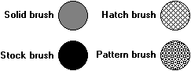

# Logical Brush Types

There are four types of logical brushes: [solid](solid-brush.md), [stock](stock-brush.md), [hatch](hatch-brush.md), and [pattern](pattern-brush.md). These brushes are shown in the following illustration.

The stock and hatch types each have several predefined brushes.

The [**CreateBrushIndirect**](/windows/desktop/api/Wingdi/nf-wingdi-createbrushindirect) function creates a logical brush with a specified style, color, and pattern.

 

 

