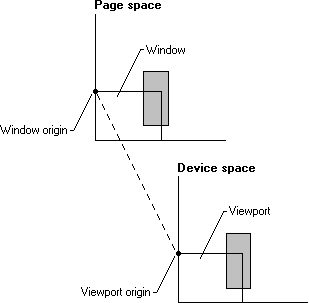

# Mapping Modes and Translations

The mapping modes are described in the following table.


| Mapping mode    | Description                                                                                                                                                                                                                                                                                                                |
|-----------------|----------------------------------------------------------------------------------------------------------------------------------------------------------------------------------------------------------------------------------------------------------------------------------------------------------------------------|
| MM\_ANISOTROPIC | Each unit in page space is mapped to an application-specified unit in device space. The axis may or may not be equally scaled (for example, a circle drawn in world space may appear to be an ellipse when depicted on a given device). The orientation of the axis is also specified by the application.                  |
| MM\_HIENGLISH   | Each unit in page space is mapped to 0.001 inch in device space. The value of x increases from left to right. The value of y increases from bottom to top.                                                                                                                                                                 |
| MM\_HIMETRIC    | Each unit in page space is mapped to 0.01 millimeter in device space. The value of x increases from left to right. The value of y increases from bottom to top.                                                                                                                                                            |
| MM\_ISOTROPIC   | Each unit in page space is mapped to an application-defined unit in device space. The axes are always equally scaled. The orientation of the axes may be specified by the application.                                                                                                                                     |
| MM\_LOENGLISH   | Each unit in page space is mapped to 0.01 inch in device space. The value of x increases from left to right. The value of y increases from bottom to top.                                                                                                                                                                  |
| MM\_LOMETRIC    | Each unit in page space is mapped to 0.1 millimeter in device space. The value of x increases from left to right. The value of y increases from bottom to top.                                                                                                                                                             |
| MM\_TEXT        | Each unit in page space is mapped to one pixel; that is, no scaling is performed at all. When no translation is in effect (this is the default), page space in the MM\_TEXT mapping mode is equivalent to physical device space. The value of x increases from left to right. The value of y increases from top to bottom. |
| MM\_TWIPS       | Each unit in page space is mapped to one twentieth of a printer's point (1/1440 inch). The value of x increases from left to right. The value of y increases from bottom to top.                                                                                                                                           |


 

To set a mapping mode, call the [**SetMapMode**](/windows/desktop/api/Wingdi/nf-wingdi-setmapmode) function. Retrieve the current mapping mode for a DC by calling the [**GetMapMode**](/windows/desktop/api/Wingdi/nf-wingdi-getmapmode) function.

The page-space to device-space transformations consist of values calculated from the points given by the window and viewport. In this context, the window refers to the logical coordinate system of the page space, while the viewport refers to the device coordinate system of the device space. The window and viewport each consist of an origin, a horizontal ("x") extent, and a vertical ("y") extent). The window parameters are in logical coordinates; the viewport in device coordinates (pixels). The system combines the origins and extents from both the window and viewport to create the transformation. This means that the window and viewport each specify half of the factors needed to define the transformation used to map points in page space to device space. Thus, the system maps the window origin to the viewport origin and the window extents to the viewport extents, as shown in the following illustration.



The window and viewport extents establish a ratio or scaling factor used in the page-space to device-space transformations. For the six predefined mapping modes (MM\_HIENGLISH, MM\_LOENGLISH, MM\_HIMETRIC, MM\_LOMETRIC, MM\_TEXT, and MM\_TWIPS), the extents are set by the system when [**SetMapMode**](/windows/desktop/api/Wingdi/nf-wingdi-setmapmode) is called. They cannot be changed. The other two mapping modes (MM\_ISOTROPIC and MM\_ANISOTROPIC) require that the extents are specified. This is done by calling **SetMapMode** to set the appropriate mode and then calling the [**SetWindowExtEx**](/windows/desktop/api/Wingdi/nf-wingdi-setwindowextex) and [**SetViewportExtEx**](/windows/desktop/api/Wingdi/nf-wingdi-setviewportextex) functions to specify the extents. In the MM\_ISOTROPIC mapping mode, it is important to call **SetWindowExtEx** before calling **SetViewportExtEx**.

The window and viewport origins establish the translation used in the page-space to device-space transformations. Set the window and viewport origins by using the [**SetWindowOrgEx**](/windows/desktop/api/Wingdi/nf-wingdi-setwindoworgex) and [**SetViewportOrgEx**](/windows/desktop/api/Wingdi/nf-wingdi-setviewportorgex) functions. The origins are independent of the extents, and an application can set them regardless of the current mapping mode. Changing a mapping mode does not affect the currently set origins (although it can affect the extents). Origins are specified in absolute units that the current mapping mode does not affect. To alter the origins, use the [**OffsetWindowOrgEx**](/windows/desktop/api/Wingdi/nf-wingdi-offsetwindoworgex) and [**OffsetViewportOrgEx**](/windows/desktop/api/Wingdi/nf-wingdi-offsetviewportorgex) functions.

The following formula shows the math involved in converting a point from page space to device space.

``` syntax
Dx = ((Lx - WOx) * VEx / WEx) + VOx 
```

The following variables are involved.

``` syntax
Dx     x value in device units 
Lx     x value in logical units (also known as page space units) 
WOx     window x origin 
VOx     viewport x origin 
WEx     window x-extent 
VEx     viewport x-extent 
```

The same equation with y replacing x transforms the y componentof a point.

The formula first offsets the point from its coordinate origin. This value, no longer biased by the origin, is then scaled into the destination coordinate system by the ratio of the extents. Finally, the scaled value is offset by the destination origin to its final mapping.

The [**LPtoDP**](/windows/desktop/api/Wingdi/nf-wingdi-lptodp) and [**DPtoLP**](/windows/desktop/api/Wingdi/nf-wingdi-dptolp) functions may be used to convert from logical points to device points and from device points to logical points, respectively.

 

 


