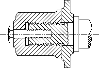

# Outlined and Filled Paths

An application can draw the outline of a path by calling the [**StrokePath**](strokepath.md) function, it can fill the interior of a path by calling the [**FillPath**](fillpath.md) function, and it can both outline and fill the path by calling the [**StrokeAndFillPath**](strokeandfillpath.md) function.

Whenever an application fills a path, the system uses the DC's current fill mode. An application can retrieve this mode by calling the [**GetPolyFillMode**](getpolyfillmode.md) function, and it can set a new fill mode by calling the [**SetPolyFillMode**](setpolyfillmode.md) function. For a description of the two fill modes, see [Regions](regions.md).

The following illustration shows the cross-section of an object created by a computer-aided design (CAD) application using paths that were both outlined and filled.

 

 

