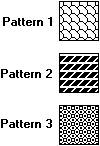

# Pattern Brush

A pattern (or custom) brush is created from an application-defined bitmap or device-independent bitmap (DIB). The following rectangles were painted by using different pattern brushes.

To create a logical pattern brush, an application must first create a bitmap. After creating the bitmap, the application can create the logical pattern brush by calling the [**CreatePatternBrush**](/windows/desktop/api/Wingdi/nf-wingdi-createpatternbrush) or [**CreateDIBPatternBrushPt**](/windows/desktop/api/Wingdi/nf-wingdi-createdibpatternbrushpt) function, supplying a handle that identifies the bitmap (or DIB). The brushes that appear in the preceding illustration were created from monochrome bitmaps. For a description of bitmaps, DIBs, and the functions that create them, see [Bitmaps](bitmaps.md).

 

 

