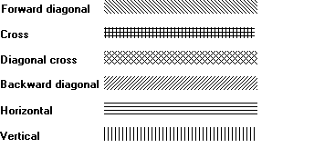

# Pen Hatch

The hatch attribute specifies the hatch type of a geometric pen with the hatch pattern attribute. There are six patterns available. The following illustration shows lines drawn using different hatch patterns.

 

 

