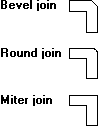

# Pen Join

The join attribute specifies how the ends of two geometric lines are joined: beveled, mitered, or round. The following illustration shows pairs of connected lines drawn using each type of join.

 

 

