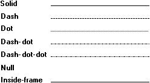

# Pen Style

The style attribute specifies the line pattern that appears when a particular cosmetic or geometric pen is used. There are eight predefined pen styles. The following illustration shows the seven of these styles that are defined by the system.

The inside-frame style is identical to the solid style for cosmetic pens. However, it operates differently when used with a geometric pen. If the geometric pen is wider than a single pixel and a drawing function uses the pen to draw a border around a filled object, the system draws the border inside the object's frame. By using the inside-frame style, an application can ensure that an object appears entirely within the specified dimensions, regardless of the geometric pen width.

In addition to the seven styles defined by the system, there is an eighth style that is user (or application) defined. A user-defined style generates lines with a customized series of dashes and dots.

Use the [**CreatePen**](/windows/desktop/api/Wingdi/nf-wingdi-createpen), [**CreatePenIndirect**](/windows/desktop/api/Wingdi/nf-wingdi-createpenindirect), or [**ExtCreatePen**](/windows/desktop/api/Wingdi/nf-wingdi-extcreatepen) function to create a pen that has the system-defined styles. Use the **ExtCreatePen** function to create a pen that has a user-defined style.

 

 

