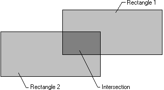
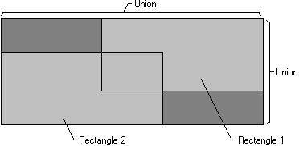

# Rectangle Operations

The [**SetRect**](/windows/desktop/api/Winuser/nf-winuser-setrect) function creates a rectangle, the [**CopyRect**](/windows/desktop/api/Winuser/nf-winuser-copyrect) function makes a copy of a given rectangle, and the [**SetRectEmpty**](/windows/desktop/api/Winuser/nf-winuser-setrectempty) function creates an empty rectangle. An empty rectangle is any rectangle that has zero width, zero height, or both. The [**IsRectEmpty**](/windows/desktop/api/Winuser/nf-winuser-isrectempty) function determines whether a given rectangle is empty. The [**EqualRect**](/windows/desktop/api/Winuser/nf-winuser-equalrect) function determines whether two rectangles are identical that is, whether they have the same coordinates.

The [**InflateRect**](/windows/desktop/api/Winuser/nf-winuser-inflaterect) function increases or decreases the width or height of a rectangle, or both. It can add or remove width from both ends of the rectangle; it can add or remove height from both the top and bottom of the rectangle.

The [**OffsetRect**](/windows/desktop/api/Winuser/nf-winuser-offsetrect) function moves a rectangle by a given amount. It moves the rectangle by adding the given x-amount, y-amount, or x- and y-amounts to the corner coordinates.

The [**PtInRect**](/windows/desktop/api/Winuser/nf-winuser-ptinrect) function determines whether a given point lies within a given rectangle. The point is in the rectangle if it lies on the left or top side or is completely within the rectangle. The point is not in the rectangle if it lies on the right or bottom side.

The [**IntersectRect**](/windows/desktop/api/Winuser/nf-winuser-intersectrect) function creates a new rectangle that is the intersection of two existing rectangles, as shown in the following figure.

The [**UnionRect**](/windows/desktop/api/Winuser/nf-winuser-unionrect) function creates a new rectangle that is the union of two existing rectangles, as shown in the following figure.

For information about functions that draw ellipses and polygons, see [Filled Shapes](filled-shapes.md).

 

 

