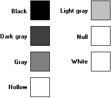

# Stock Brush

There are seven predefined logical stock brushes maintained by the graphics device interface (GDI). There are also 21 predefined logical stock brushes maintained by the window management interface (USER).

The following illustration shows rectangles painted by using the seven predefined stock brushes.

An application can retrieve a handle identifying one of the seven stock brushes by calling the [**GetStockObject**](/windows/desktop/api/Wingdi/nf-wingdi-getstockobject) function, specifying the brush type.

The 21 stock brushes maintained by the window management interface correspond to the colors of window elements such as menus, scroll bars, and buttons. An application can obtain a handle identifying one of these brushes by calling the [**GetSysColorBrush**](/windows/desktop/api/Winuser/nf-winuser-getsyscolorbrush) function and specifying a system-color value. An application can retrieve the color corresponding to a particular window element by calling the [**GetSysColor**](/windows/win32/api/winuser/nf-winuser-getsyscolor) function. An application can set the color corresponding to a window element by calling the [**SetSysColors**](/windows/win32/api/winuser/nf-winuser-setsyscolors) function.

 

 
