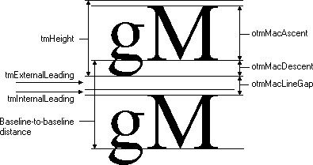

# String Widths and Heights

In addition to retrieving character-width data for individual characters, applications also need to compute the width and height of entire strings. Two functions retrieve string-width and height measurements: [**GetTextExtentPoint32**](gettextextentpoint32.md), and [**GetTabbedTextExtent**](gettabbedtextextent.md). If the string does not contain tab characters, an application can use the **GetTextExtentPoint32** function to retrieve the width and height of a specified string. If the string contains tab characters, an application should call the GetTabbedTextExtent function.

Applications can use the [**GetTextExtentExPoint**](gettextextentexpoint.md) function for word-wrapping operations. This function returns the number of characters from a specified string that fit within a specified space.

## Font Ascenders and Descenders

Some applications determine the line spacing between text lines of different sizes by using a font's maximum ascender and descender. An application can retrieve these values by calling the [**GetTextMetrics**](gettextmetrics.md) function and then checking the **tmAscent** and **tmDescent** members of the [**TEXTMETRIC**](textmetric.md).

The maximum ascent and descent are different from the typographic ascent and descent. In TrueType and OpenType fonts, the typographic ascent and descent are typically the top of the f glyph and bottom of the g glyph. An application can retrieve the typographic ascender and descender for a TrueType or OpenType font by calling the [**GetOutlineTextMetrics**](getoutlinetextmetrics.md) function and checking the values in the **otmMacAscent** and **otmMacDescent** members of the [**OUTLINETEXTMETRIC**](outlinetextmetric.md) structure.

The following figure shows the difference between the vertical text metric values returned in the [**NEWTEXTMETRIC**](newtextmetric.md) and [**OUTLINETEXTMETRIC**](gdi.OUTLINETEXTMETRIC) structures. (The names beginning with otm are members of the **OUTLINETEXTMETRIC** structure.)

## Font Dimensions

An application can retrieve the physical dimensions of a TrueType or OpenType font by calling the [**GetOutlineTextMetrics**](getoutlinetextmetrics.md) function. An application can retrieve the physical dimensions of any other font by calling the [**GetTextMetrics**](gettextmetrics.md) function. To determine the dimensions of an output device, an application can call the [**GetDeviceCaps**](getdevicecaps.md) function. **GetDeviceCaps** returns both physical and logical dimensions.

A logical inch is a measure the system uses to present legible fonts on the screen and is approximately 30 to 40 percent larger than a physical inch. The use of logical inches precludes an exact match between the output of the screen and printer. Developers should be aware that the text on a screen is not simply a scaled version of the text that will appear on the page, particularly if graphics are incorporated into the text.

 

 

