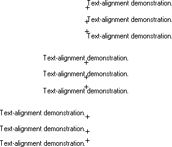
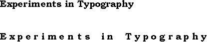

# Text-Formatting Attributes

An application can use six functions to set the text-formatting attributes for a device context: [SetBkColor](/windows/desktop/api/Wingdi/nf-wingdi-setbkcolor), [SetBkMode](/windows/desktop/api/Wingdi/nf-wingdi-setbkmode), [SetTextAlign](/windows/desktop/api/Wingdi/nf-wingdi-settextalign), [SetTextCharacterExtra](/windows/desktop/api/Wingdi/nf-wingdi-settextcharacterextra), [SetTextColor](/windows/desktop/api/Wingdi/nf-wingdi-settextcolor), and [SetTextJustification](/windows/desktop/api/Wingdi/nf-wingdi-settextjustification). These functions affect the text alignment, the intercharacter spacing, the text justification, and text and background colors. In addition, six other functions can be used to retrieve the current text formatting attributes for any device context: [GetBkColor](/windows/desktop/api/Wingdi/nf-wingdi-getbkcolor), [GetBkMode](/windows/desktop/api/Wingdi/nf-wingdi-getbkmode), [GetTextAlign](/windows/desktop/api/Wingdi/nf-wingdi-gettextalign), [GetTextCharacterExtra](/windows/desktop/api/Wingdi/nf-wingdi-gettextcharacterextra), [GetTextColor](/windows/desktop/api/Wingdi/nf-wingdi-gettextcolor), and [GetTextExtentPoint32](/windows/desktop/api/Wingdi/nf-wingdi-gettextextentpoint32a).

## Text Alignment

Applications can use the [SetTextAlign](/windows/desktop/api/Wingdi/nf-wingdi-settextalign) function to specify how the system should position the characters in a string of text when they call one of the drawing functions. This function can be used to position headings, page numbers, callouts, and so on. The system positions a string of text by aligning a reference point on an imaginary rectangle that surrounds the string, with the current cursor position or with a point passed as an argument to one of the text drawing functions. The [**SetTextAlign**](/windows/win32/api/wingdi/nf-wingdi-settextalign) function lets the application specify the location of this reference point. The following is a list of the possible reference point locations.

| Location         | Description                                                                                                             |
|------------------|-------------------------------------------------------------------------------------------------------------------------|
| left/bottom      | The reference point is located at the lower-left corner of the rectangle.                                               |
| left/base line   | The reference point is located at the intersection of the character-cell base line and the left edge of the rectangle.  |
| left/top         | The reference point is located at the top-left corner of the rectangle.                                                 |
| center/bottom    | The reference point is located at the center of the bottom of the rectangle.                                            |
| center/base line | The reference point is located at the intersection of the character-cell base line and the center of the rectangle.     |
| center/top       | The reference point is located at the center of the top of the rectangle.                                               |
| right/bottom     | The reference point is located at the lower-right corner of the rectangle.                                              |
| right/base line  | The reference point is located at the intersection of the character-cell base line and the right edge of the rectangle. |
| right/top        | The reference point is located at the top-right corner of the rectangle.                                                |

 

The following illustration shows a string of text drawn by calling the [TextOut](/windows/desktop/api/Wingdi/nf-wingdi-textouta) function. Before drawing the text, the [SetTextAlign](/windows/desktop/api/Wingdi/nf-wingdi-settextalign) function was called to relocate the reference point at each one of the nine possible locations.

The default text alignment for a device context is the upper-left corner of the imaginary rectangle that surrounds the text. An application can retrieve the current text-alignment setting for any device context by calling the [GetTextAlign](/windows/desktop/api/Wingdi/nf-wingdi-gettextalign) function.

## Intercharacter Spacing

Applications can use the [SetTextCharacterExtra](/windows/desktop/api/Wingdi/nf-wingdi-settextcharacterextra) function to alter the intercharacter spacing for all text output operations in a specified device context. The following illustration shows a string of text drawn twice by calling the [TextOut](/windows/desktop/api/Wingdi/nf-wingdi-textouta) function. Before drawing the text the second time, the [**SetTextCharacterExtra**](/windows/win32/api/wingdi/nf-wingdi-settextcharacterextra) function was called to increment the intercharacter spacing.

The default intercharacter spacing value for any device context is zero. An application can retrieve the current intercharacter spacing value for a device context by calling the [GetTextCharacterExtra](/windows/desktop/api/Wingdi/nf-wingdi-gettextcharacterextra) function.

## Text Justification

Applications can use the [GetTextExtentPoint32](/windows/desktop/api/Wingdi/nf-wingdi-gettextextentpoint32a) and [SetTextJustification](/windows/desktop/api/Wingdi/nf-wingdi-settextjustification) functions to justify a line of text. Text justification is a common operation in any desktop publishing and in most word processing applications. The [**GetTextExtentPoint32**](/windows/win32/api/wingdi/nf-wingdi-gettextextentpoint32a) function computes the width and height of a string of text. After the width is computed, the application can call the [**SetTextJustification**](/windows/win32/api/wingdi/nf-wingdi-settextjustification) function to distribute extra spacing between each of the words in a line of text. The following illustration shows a paragraph of text printed twice: in the first paragraph, the text was not justified; in the second paragraph, the text was justified by calling the **GetTextExtentPoint32** and **SetTextJustification** functions.

## Text and Background Color

Applications can use the [SetTextColor](/windows/desktop/api/Wingdi/nf-wingdi-settextcolor) function to set the color of text drawn in the client-area of their windows, as well as the color of text drawn on a color printer. An application can use the [SetBkColor](/windows/desktop/api/Wingdi/nf-wingdi-setbkcolor) function to set the color that appears behind each character and the [SetBkMode](/windows/desktop/api/Wingdi/nf-wingdi-setbkmode) function to specify how the system should blend the selected background color with the current color or colors on the video display.

The default text color for a display device context is black; the default background color is white; and the default background mode is OPAQUE. An application can retrieve the current text color for a device context by calling the [GetTextColor](/windows/desktop/api/Wingdi/nf-wingdi-gettextcolor) function. An application can retrieve the current background color for a device context by calling the [GetBkColor](/windows/desktop/api/Wingdi/nf-wingdi-getbkcolor) function and the current background mode by calling the [GetBkMode](/windows/desktop/api/Wingdi/nf-wingdi-getbkmode) function.

 

 
