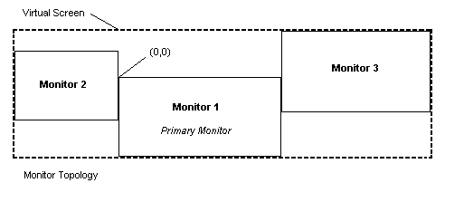

# The Virtual Screen

The bounding rectangle of all the monitors is the *virtual screen*. The desktop covers the virtual screen instead of a single monitor. The following illustration shows a possible arrangement of three monitors.



The *primary monitor* contains the origin (0,0). This is for compatibility with existing applications that expect a monitor with an origin. However, the primary monitor does not have to be in the upper left of the virtual screen. In Figure 1, it is near the center. When the primary monitor is not in the upper left of the virtual screen, parts of the virtual screen have negative coordinates. Because the arrangement of monitors is set by the user, all applications should be designed to work with negative coordinates. For more information, see [Multiple Monitor Considerations for Older Programs](multiple-monitor-considerations-for-older-programs.md).

The coordinates of the virtual screen are represented by a signed 16-bit value because of the 16-bit values contained in many existing messages. Thus, the bounds of the virtual screen are:

``` syntax
SHORT_MIN    <= rcVirtualScreen.left   <= SHORT_MAX - 1
SHORT_MIN +1 <= rcVirtualScreen.right  <= SHORT_MAX
SHORT_MIN    <= rcVirtualScreen.top    <= SHORT_MAX - 1
SHORT_MIN +1 <= rcVirtualScreen.bottom <= SHORT_MAX
```

 

 


