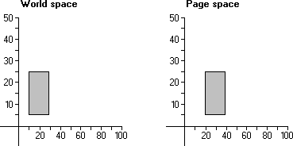

# Translation

Some applications translate (or shift) objects drawn in the client area. by calling the [**SetWorldTransform**](/windows/desktop/api/Wingdi/nf-wingdi-setworldtransform) function to set the appropriate world-space to page-space transformation. The SetWorldTransform function receives a pointer to an [**XFORM**](/windows/win32/api/wingdi/ns-wingdi-xform) structure containing the appropriate values. The eDx and eDy members of XFORM specify the horizontal and vertical translation components, respectively.

When *translation* occurs, each point in an object is shifted vertically, horizontally, or both, by a specified amount. The following illustration shows a 20- by 20-unit rectangle that was translated to the right by 10 units when copied from world-coordinate space to page-coordinate space.



In the preceding illustration, the x-coordinate of each point in the rectangle is 10 units greater than the original x-coordinate.

Horizontal translation can be represented by the following algorithm.

``` syntax
x' = x + Dx 
```

Where x' is the new x-coordinate, x is the original x-coordinate, and Dx is the horizontal distance moved.

Vertical translation can be represented by the following algorithm.

``` syntax
y' = y + Dy 
```

Where y' is the new y-coordinate, y is the original y-coordinate, and Dy is the vertical distance moved.

The horizontal and vertical translation transformations can be combined into a single operation by using a 3-by-3 matrix.

``` syntax
                      |1   0   0| 
|x' y' 1| = |x y 1| * |0   1   0| 
                      |Dx  Dy  1| 
```

(The rules of matrix multiplication state that the number of rows in one matrix must equal the number of columns in the other. The integer 1 in the matrix \|x y 1\| is a placeholder that was added to meet this requirement.)

The 3-by-3 matrix that produced the illustrated translation transformation contains the following values.

``` syntax
|1  0  0| 
|0  1  0| 
|10 0  1| 
```

 

 


