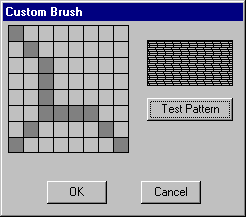

# Using Brushes

You can use a brush to paint the interior of virtually any shape by using a graphics device interface (GDI) function. This includes the interiors of rectangles, ellipses, polygons, and paths. Depending on the requirements of your application, you can use a solid brush of a specified color, a stock brush, a hatch brush, or a pattern brush.

This section contains code samples that demonstrate the creation of a custom brush dialog box. The dialog box contains a grid that represents the bitmap the system uses as a brush. A user can use this grid to create a pattern-brush bitmap and then view the custom pattern by clicking the **Test Pattern** button.

The following illustration shows a pattern created by using the **Custom Brush** dialog box.



To display a dialog box, you must first create a dialog box template. The following dialog box template defines the **Custom Brush** dialog box.


```C++
CustBrush DIALOG 6, 18, 160, 118 
STYLE WS_DLGFRAME | WS_POPUP | WS_VISIBLE | WS_CAPTION 
CAPTION "Custom Brush" 
FONT 8, "MS Sans Serif" 
BEGIN 
    CONTROL         "", IDD_GRID, "Static", SS_BLACKFRAME | 
                    WS_CHILD, 3, 2, 83, 79 
    CONTROL         "", IDD_RECT, "Static", SS_BLACKFRAME | 
                    WS_CHILD, 96, 11, 57, 28 
    PUSHBUTTON      "Test Pattern", IDD_PAINTRECT, 96, 47, 57, 14 
    PUSHBUTTON      "OK", IDD_OK, 29, 98, 40, 14 
    PUSHBUTTON      "Cancel", IDD_CANCEL, 92, 98, 40, 14 
END 
```


The **Custom Brush** dialog box contains five controls: a bitmap-grid window, a pattern-viewing window, and three push buttons, labeled **Test Pattern**, **OK**, and **Cancel**. The **Test Pattern** push button enables the user to view the pattern. The dialog box template specifies the overall dimensions of the dialog box window, assigns a value to each control, specifies the location of each control, and so forth. For more information, see [Dialog Boxes](../dlgbox/dialog-boxes.md).

The control values in the dialog box template are constants that have been defined as follows in the application's header file.


```C++
#define IDD_GRID      120 
#define IDD_RECT      121 
#define IDD_PAINTRECT 122 
#define IDD_OK        123 
#define IDD_CANCEL    124 
```


After you create a dialog box template and include it in the application's resource-definition file, you must write a dialog procedure. This procedure processes messages that the system sends to the dialog box. The following excerpt from an application's source code shows the dialog box procedure for the **Custom Brush** dialog box and the two application-defined functions it calls.


```C++
BOOL CALLBACK BrushDlgProc( HWND hdlg, UINT message, LONG wParam, 
                            LONG lParam) 
{ 
    static HWND hwndGrid;       // grid-window control  
    static HWND hwndBrush;      // pattern-brush control  
    static RECT rctGrid;        // grid-window rectangle  
    static RECT rctBrush;       // pattern-brush rectangle  
    static UINT bBrushBits[8];  // bitmap bits  
    static RECT rect[64];       // grid-cell array  
    static HBITMAP hbm;         // bitmap handle  
    HBRUSH hbrush;              // current brush  
    HBRUSH hbrushOld;           // default brush  
    HRGN hrgnCell;              // test-region handle  
    HDC hdc;                    // device context (DC) handle  
    int x, y, deltaX, deltaY;   // drawing coordinates  
    POINTS ptlHit;              // mouse coordinates  
    int i;                      // count variable  
 
    switch (message) 
        { 
        case WM_INITDIALOG: 
 
            // Retrieve a window handle for the grid-window and  
            // pattern-brush controls.  
 
            hwndGrid = GetDlgItem(hdlg, IDD_GRID); 
            hwndBrush = GetDlgItem(hdlg, IDD_RECT); 
 
            // Initialize the array of bits that defines the  
            // custom brush pattern with the value 1 to produce a  
            // solid white brush.  

            for (i=0; i<8; i++) 
                bBrushBits[i] = 0xFF; 
 
            // Retrieve dimensions for the grid-window and pattern- 
            // brush controls.  
 
            GetClientRect(hwndGrid, &rctGrid); 
            GetClientRect(hwndBrush, &rctBrush); 
 
            // Determine the width and height of a single cell.  
 
            deltaX = (rctGrid.right - rctGrid.left)/8; 
            deltaY = (rctGrid.bottom - rctGrid.top)/8; 
 
            // Initialize the array of cell rectangles.  
 
            for (y=rctGrid.top, i=0; y < rctGrid.bottom; y += deltaY)
            { 
                for(x=rctGrid.left; x < (rctGrid.right - 8) && i < 64; 
                        x += deltaX, i++) 
                { 
                    rect[i].left = x; rect[i].top = y; 
                    rect[i].right = x + deltaX; 
                    rect[i].bottom = y + deltaY; 
                } 
            } 
            return FALSE; 
 
 
        case WM_PAINT: 

            // Draw the grid.  
 
            hdc = GetDC(hwndGrid); 
 
            for (i=rctGrid.left; i<rctGrid.right; 
                 i+=(rctGrid.right - rctGrid.left)/8)
            { 
                 MoveToEx(hdc, i, rctGrid.top, NULL); 
                 LineTo(hdc, i, rctGrid.bottom); 
            } 
            for (i=rctGrid.top; i<rctGrid.bottom; 
                 i+=(rctGrid.bottom - rctGrid.top)/8)
            { 
                 MoveToEx(hdc, rctGrid.left, i, NULL); 
                 LineTo(hdc, rctGrid.right, i); 
            } 
            ReleaseDC(hwndGrid, hdc); 
            return FALSE; 
 
 
        case WM_LBUTTONDOWN: 
 
            // Store the mouse coordinates in a POINT structure.  
 
            ptlHit = MAKEPOINTS((POINTS FAR *)lParam); 
 
            // Create a rectangular region with dimensions and  
            // coordinates that correspond to those of the grid  
            // window.  
 
            hrgnCell = CreateRectRgn(rctGrid.left, rctGrid.top, 
                        rctGrid.right, rctGrid.bottom); 
 
            // Retrieve a window DC for the grid window.  
 
            hdc = GetDC(hwndGrid); 
 
            // Select the region into the DC.  
 
            SelectObject(hdc, hrgnCell); 
 
            // Test for a button click in the grid-window rectangle.  
 
            if (PtInRegion(hrgnCell, ptlHit.x, ptlHit.y))
            { 
                // A button click occurred in the grid-window  
                // rectangle; isolate the cell in which it occurred.  
 
                for(i=0; i<64; i++)
                { 
                    DeleteObject(hrgnCell); 
 
                    hrgnCell = CreateRectRgn(rect[i].left,  
                               rect[i].top, 
                               rect[i].right, rect[i].bottom); 
 
                    if (PtInRegion(hrgnCell, ptlHit.x, ptlHit.y))
                    { 
                        InvertRgn(hdc, hrgnCell); 
 
                        // Set the appropriate brush bits.  
 
                         if (i % 8 == 0) 
                            bBrushBits[i/8] = bBrushBits[i/8] ^ 0x80; 
                         else if (i % 8 == 1) 
                            bBrushBits[i/8] = bBrushBits[i/8] ^ 0x40; 
                         else if (i % 8 == 2) 
                            bBrushBits[i/8] = bBrushBits[i/8] ^ 0x20; 
                         else if (i % 8 == 3) 
                            bBrushBits[i/8] = bBrushBits[i/8] ^ 0x10; 
                         else if (i % 8 == 4) 
                            bBrushBits[i/8] = bBrushBits[i/8] ^ 0x08; 
                         else if (i % 8 == 5) 
                            bBrushBits[i/8] = bBrushBits[i/8] ^ 0x04; 
                         else if (i % 8 == 6) 
                            bBrushBits[i/8] = bBrushBits[i/8] ^ 0x02; 
                         else if (i % 8 == 7) 
                            bBrushBits[i/8] = bBrushBits[i/8] ^ 0x01; 
 
                      // Exit the "for" loop after the bit is set.  
 
                         break; 
                    } // end if  
 
                } // end for  
 
            } // end if  
 
            // Release the DC for the control.  
 
            ReleaseDC(hwndGrid, hdc); 
            return TRUE; 
 
 
        case WM_COMMAND: 
            switch (wParam)
            { 
               case IDD_PAINTRECT: 
 
                    hdc = GetDC(hwndBrush); 
 
                    // Create a monochrome bitmap.  
 
                    hbm = CreateBitmap(8, 8, 1, 1, 
                          (LPBYTE)bBrushBits); 
 
                    // Select the custom brush into the DC.  
 
                    hbrush = CreatePatternBrush(hbm); 
 
                    hbrushOld = SelectObject(hdc, hbrush); 
 
                    // Use the custom brush to fill the rectangle.  
 
                    Rectangle(hdc, rctBrush.left, rctBrush.top, 
                              rctBrush.right, rctBrush.bottom); 
 
                    // Clean up memory.  
                    SelectObject(hdc, hbrushOld); 
                    DeleteObject(hbrush); 
                    DeleteObject(hbm); 
 
                    ReleaseDC(hwndBrush, hdc); 
                    return TRUE; 
 
                case IDD_OK: 
 
                case IDD_CANCEL: 
                    EndDialog(hdlg, TRUE); 
                    return TRUE; 
 
            } // end switch  
            break; 
        default: 
            return FALSE; 
        } 
} 
 
 
int GetStrLngth(LPTSTR cArray) 
{ 
    int i = 0; 
 
    while (cArray[i++] != 0); 
    return i-1; 
 
} 
 
DWORD RetrieveWidth(LPTSTR cArray, int iLength) 
{ 
    int i, iTmp; 
    double dVal, dCount; 
 
    dVal = 0.0; 
    dCount = (double)(iLength-1); 
    for (i=0; i<iLength; i++)
    { 
        iTmp = cArray[i] - 0x30; 
        dVal = dVal + (((double)iTmp) * pow(10.0, dCount--)); 
    } 
 
    return (DWORD)dVal; 
} 
```


The dialog box procedure for the **Custom Brush** dialog box processes four messages, as described in the following table.


| Message                                          | Action                                                                                                                                                                                                                                                                                                     |
|--------------------------------------------------|------------------------------------------------------------------------------------------------------------------------------------------------------------------------------------------------------------------------------------------------------------------------------------------------------------|
| [**WM\_INITDIALOG**](../dlgbox/wm-initdialog.md)   | Retrieves a window handle and dimensions for the grid-window and pattern-brush controls, computes the dimensions of a single cell in the grid-window control, and initializes an array of grid-cell coordinates.                                                                                           |
| [**WM\_PAINT**](wm-paint.md)                    | Draws the grid pattern in the grid-window control.                                                                                                                                                                                                                                                         |
| [**WM\_LBUTTONDOWN**](../inputdev/wm-lbuttondown.md) | Determines whether the cursor is within the grid-window control when the user presses the left mouse button. If so, the dialog box procedure inverts the appropriate grid cell and records the state of that cell in an array of bits that is used to create the bitmap for the custom brush.              |
| [**WM\_COMMAND**](../menurc/wm-command.md)         | Processes input for the three push button controls. If the user clicks the **Test Pattern** button, the dialog box procedure paints the Test Pattern control with the new custom brush pattern. If the user clicks the **OK** or **Cancel** button, the dialog box procedure performs actions accordingly. |


 

For more information about messages and message processing, see [Messages and Message Queues](../winmsg/messages-and-message-queues.md).

After you write the dialog box procedure, include the function definition for the procedure in the application's header file and then call the dialog box procedure at the appropriate point in the application.

The following excerpt from the application's header file shows the function definition for the dialog box procedure and the two functions it calls.


```C++
BOOL CALLBACK BrushDlgProc(HWND, UINT, WPARAM, LPARAM); 
int GetStrLngth(LPTSTR); 
DWORD RetrieveWidth(LPTSTR, int); 
```


Finally, the following code shows how the dialog box procedure is called from the application's source-code file.


```C++
    DialogBox((HANDLE)GetModuleHandle(NULL), 
        (LPTSTR)"CustBrush", 
        hWnd, 
        (DLGPROC) BrushDlgProc); 
```


This call is usually made in response to the user choosing an option from the application's menu.

 

 
