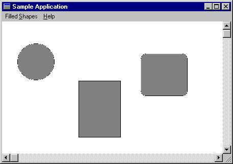

# Using Filled Shapes

This section illustrates how to use filled shape functions. The example uses the main window procedure from an application that enables the user to draw ellipses, rectangles, and rectangles with rounded corners.

The user draws a filled shape by selecting a particular shape from the menu, positioning the cursor at the upper-left corner of the shape (or the shape's bounding rectangle in the case of an ellipse), and then dragging the mouse until the desired dimensions are obtained.

The following illustration shows three filled shapes drawn using the sample code in this section.



To enable the user to draw filled shapes, include the following popup menu in your application.


```C++
   POPUP "Filled &Shapes"
   {
      MENUITEM "&Ellipse",   IDM_ELLIPSE
      MENUITEM "&Rectangle", IDM_RECTANGLE
      MENUITEM "R&oundRect", IDM_ROUNDRECT
   }
```


The menu item values in the menu template are constants that you must define as follows in your application's header file.


```C++
#define IDM_ELLIPSE    1100
#define IDM_RECTANGLE  1200
#define IDM_ROUNDRECT  1300
```


Finally, include the following window procedure in your application.


```C++
BOOL CALLBACK MainWndProc(HWND hwnd, UINT uMsg, WPARAM wParam, 
                          LPARAM lParam) 
{ 
    HDC hdc;          // handle to device context (DC)  
    PAINTSTRUCT ps;   // paint data for Begin/EndPaint  
    POINT ptClientUL; // client area upper left corner  
    POINT ptClientLR; // client area lower right corner  
    static HDC hdcCompat; // handle to DC for bitmap  
    static POINT pt;      // x- and y-coordinates of cursor  
    static RECT rcTarget; // rect to receive filled shape  
    static RECT rcClient; // client area rectangle  
    static BOOL fSizeEllipse; // TRUE if ellipse is sized  
    static BOOL fDrawEllipse;   // TRUE if ellipse is drawn  
    static BOOL fDrawRectangle; // TRUE if rectangle is drawn  
    static BOOL fSizeRectangle; // TRUE if rectangle is sized  
    static BOOL fSizeRoundRect; // TRUE if rounded rect is sized  
    static BOOL fDrawRoundRect; // TRUE if rounded rect is drawn  
    static int nEllipseWidth;   // width for round corners  
    static int nEllipseHeight;  // height for round corners  
 
    switch (uMsg) 
    { 
        case WM_COMMAND: 
            switch (wParam) 
            { 

                // Set the appropriate flag to indicate which  
                // filled shape the user is drawing.  

                case IDM_ELLIPSE: 
                    fSizeEllipse = TRUE; 
                break; 
 
                case IDM_RECTANGLE: 
                    fSizeRectangle = TRUE; 
                break; 
 
                case IDM_ROUNDRECT: 
                    fSizeRoundRect = TRUE; 
                break; 
 
                default: 
                    return DefWindowProc(hwnd, uMsg, wParam, 
                         lParam); 
            } 
            break; 
 
 
        case WM_CREATE: 
            nEllipseWidth = 20; 
            nEllipseHeight = 20; 
 
            return 0; 
 
        case WM_PAINT: 
 
 
            BeginPaint(hwnd, &ps); 
 
            // Because the default brush is white, select  
            // a different brush into the device context  
            // to demonstrate the painting of filled shapes.  
 
            SelectObject(ps.hdc, GetStockObject(GRAY_BRUSH)); 
 
            // If one of the filled shape "draw" flags is TRUE,  
            // draw the corresponding shape.  
 
            if (fDrawEllipse) 
            {
                Ellipse(ps.hdc, rcTarget.left, rcTarget.top, 
                    rcTarget.right, rcTarget.bottom); 
                fDrawEllipse = FALSE; 
                rcTarget.left = rcTarget.right = 0; 
                rcTarget.top = rcTarget.bottom = 0; 
            } 
 
            if (fDrawRectangle) 
            {
                Rectangle(ps.hdc, rcTarget.left, rcTarget.top, 
                    rcTarget.right, rcTarget.bottom); 
                fDrawRectangle = FALSE; 
                rcTarget.left = rcTarget.right = 0; 
                rcTarget.top = rcTarget.bottom = 0; 
            } 
 
            if (fDrawRoundRect) 
            {
                RoundRect(ps.hdc, rcTarget.left, rcTarget.top, 
                    rcTarget.right, rcTarget.bottom, 
                    nEllipseWidth, nEllipseHeight); 
                fDrawRectangle = FALSE; 
                rcTarget.left = rcTarget.right = 0; 
                rcTarget.top = rcTarget.bottom = 0; 
            } 
 
            EndPaint(hwnd, &ps); 
            break; 
 
        case WM_SIZE: 
 
            // Convert the client coordinates of the client area  
            // rectangle to screen coordinates and save them in a  
            // rectangle. The rectangle is passed to the ClipCursor  
            // function during WM_LBUTTONDOWN processing.  
 
            GetClientRect(hwnd, &rcClient); 
            ptClientUL.x = rcClient.left; 
            ptClientUL.y = rcClient.top; 
            ptClientLR.x = rcClient.right; 
            ptClientLR.y = rcClient.bottom; 
            ClientToScreen(hwnd, &ptClientUL); 
            ClientToScreen(hwnd, &ptClientLR); 
            SetRect(&rcClient, ptClientUL.x, ptClientUL.y, 
                ptClientLR.x, ptClientLR.y); 
            return 0; 
 
        case WM_LBUTTONDOWN: 
 
            // Restrict the cursor to the client area.  
            // This ensures that the window receives a matching  
            // WM_LBUTTONUP message.  
 
            ClipCursor(&rcClient); 
 
            // Save the coordinates of the cursor.  
 
            pt.x = (LONG) LOWORD(lParam); 
            pt.y = (LONG) HIWORD(lParam); 
 
            // If the user chooses one of the filled shapes,  
            // set the appropriate flag to indicate that the  
            // shape is being sized.  
 
             if (fDrawEllipse) 
                fSizeEllipse = TRUE; 
 
            return 0; 
 
        case WM_MOUSEMOVE: 
 
            // If one of the "size" flags is set, draw  
            // the target rectangle as the user drags  
            // the mouse.  
 
            if ((wParam && MK_LBUTTON) 
                    && (fSizeEllipse || fSizeRectangle 
                    || fSizeRoundRect)) 
            {  
 
                // Set the mixing mode so that the pen color is the  
                // inverse of the background color. The previous  
                // rectangle can then be erased by drawing  
                // another rectangle on top of it.  
 
                hdc = GetDC(hwnd); 
                SetROP2(hdc, R2_NOTXORPEN); 
 
                // If a previous target rectangle exists, erase  
                // it by drawing another rectangle on top.  
 
                if (!IsRectEmpty(&rcTarget)) 
                {
                    Rectangle(hdc, rcTarget.left, rcTarget.top, 
                        rcTarget.right, rcTarget.bottom); 
                }

                // Save the coordinates of the target rectangle.  
                // Avoid invalid rectangles by ensuring that the  
                // value of the left coordinate is greater than  
                // that of the right, and that the value of the  
                // bottom coordinate is greater than that of  
                // the top.  
 
                if ((pt.x < (LONG) LOWORD(lParam)) && 
                        (pt.y > (LONG) HIWORD(lParam))) 
                {
                    SetRect(&rcTarget, pt.x, HIWORD(lParam), 
                        LOWORD(lParam), pt.y); 
                } 
 
                else if ((pt.x > (LONG) LOWORD(lParam)) && 
                        (pt.y > (LONG) HIWORD(lParam))) 
                {
                    SetRect(&rcTarget, LOWORD(lParam), 
                        HIWORD(lParam), pt.x, pt.y); 
                }
 
                else if ((pt.x > (LONG) LOWORD(lParam)) && 
                        (pt.y < (LONG) HIWORD(lParam))) 
                {
                    SetRect(&rcTarget, LOWORD(lParam), pt.y, 
                        pt.x, HIWORD(lParam)); 
                }
                else 
                {
                    SetRect(&rcTarget, pt.x, pt.y, LOWORD(lParam), 
                        HIWORD(lParam)); 
                }
 
                // Draw the new target rectangle.  
 
                Rectangle(hdc, rcTarget.left, rcTarget.top, 
                    rcTarget.right, rcTarget.bottom); 
                ReleaseDC(hwnd, hdc); 
            } 
            return 0; 
 
        case WM_LBUTTONUP: 
 
            // If one of the "size" flags is TRUE, reset it to FALSE,  
            // and then set the corresponding "draw" flag. Invalidate  
            // the appropriate rectangle and issue a WM_PAINT message.  
 
            if (fSizeEllipse) 
            { 
                fSizeEllipse = FALSE; 
                fDrawEllipse = TRUE; 
            } 
 
            if (fSizeRectangle) 
            { 
                fSizeRectangle = FALSE; 
                fDrawRectangle = TRUE; 
            } 
 
            if (fSizeRoundRect) 
            { 
                fSizeRoundRect = FALSE; 
                fDrawRoundRect = TRUE; 
            } 
 
            if (fDrawEllipse || fDrawRectangle || fDrawRoundRect) 
            { 
                InvalidateRect(hwnd, &rcTarget, TRUE); 
                UpdateWindow(hwnd); 
            } 
 
            // Release the cursor.  
 
            ClipCursor((LPRECT) NULL); 
            return 0; 
 
        case WM_DESTROY: 
 
            // Destroy the background brush, compatible bitmap,  
            // and bitmap.  
 
            DeleteDC(hdcCompat); 
            PostQuitMessage(0); 
            break; 
 
        default: 
            return DefWindowProc(hwnd, uMsg, wParam, lParam); 
    } 
    return (LRESULT) NULL; 
} 
```


 

 


