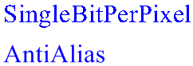

# Antialiasing with Text

Windows GDI+ provides various quality levels for drawing text. Typically, higher quality rendering takes more processing time than lower quality rendering.

The quality level is a property of the [**Graphics**](-gdiplus-class-graphics-class.md) class. To set the quality level, call the [**Graphics::SetTextRenderingHint**](-gdiplus-class-graphics-settextrenderinghint-newmode-.md) method of a **Graphics** object. The **Graphics::SetTextRenderingHint** method receives one of the elements of the [**TextRenderingHint**](-gdiplus-enum-textrenderinghint.md) enumeration, which is declared in Gdiplusenums.h.

GDI+ provides traditional antialiasing and a new kind of antialiasing based on Microsoft ClearType display technology only available on Windows XP and Windows Server 2003 and later versions of Windows. ClearType smoothing improves readability on color LCD monitors that have a digital interface, such as the monitors in laptops and high-quality flat desktop displays. Readability on CRT screens is also somewhat improved.

ClearType is dependent on the orientation and ordering of the LCD stripes. Currently, ClearType is implemented only for vertical stripes that are ordered RGB. This might be a concern if you are using a tablet PC, where the display can be oriented in any direction, or if you are using a screen that can be turned from landscape to portrait.

The following example draws text with two different quality settings:


```
FontFamily  fontFamily(L"Times New Roman");
Font        font(&amp;fontFamily, 32, FontStyleRegular, UnitPixel);
SolidBrush  solidBrush(Color(255, 0, 0, 255));
WCHAR       string1[] = L"SingleBitPerPixel";
WCHAR       string2[] = L"AntiAlias";

graphics.SetTextRenderingHint(TextRenderingHintSingleBitPerPixel);
graphics.DrawString(string1, -1, &amp;font, PointF(10.0f, 10.0f), &amp;solidBrush);

graphics.SetTextRenderingHint(TextRenderingHintAntiAlias);
graphics.DrawString(string2, -1, &amp;font, PointF(10.0f, 60.0f), &amp;solidBrush);
            
```


The following illustration shows the output of the preceding code.



 

 


