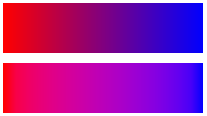
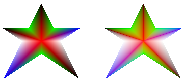

# Applying Gamma Correction to a Gradient

You can enable gamma correction for a gradient brush by passing **TRUE** to the [**PathGradientBrush::SetGammaCorrection**](/windows/desktop/api/Gdipluspath/nf-gdipluspath-pathgradientbrush-setgammacorrection) method of that brush. You can disable gamma correction by passing **FALSE** to the **PathGradientBrush::SetGammaCorrection** method. Gamma correction is disabled by default.

The following example creates a linear gradient brush and uses that brush to fill two rectangles. The first rectangle is filled without gamma correction and the second rectangle is filled with gamma correction.


```
LinearGradientBrush linGrBrush(
   Point(0, 10),
   Point(200, 10),
   Color(255, 255, 0, 0),   // Opaque red
   Color(255, 0, 0, 255));  // Opaque blue

graphics.FillRectangle(&linGrBrush, 0, 0, 200, 50);
linGrBrush.SetGammaCorrection(TRUE);
graphics.FillRectangle(&linGrBrush, 0, 60, 200, 50); 
```


The following illustration shows the two filled rectangles. The top rectangle, which does not have gamma correction, appears dark in the middle. The bottom rectangle, which has gamma correction, appears to have more uniform intensity.



The following example creates a path gradient brush based on a star-shaped path. The code uses the path gradient brush with gamma correction disabled (the default) to fill the path. Then the code passes **TRUE** to the [**PathGradientBrush::SetGammaCorrection**](/windows/desktop/api/Gdipluspath/nf-gdipluspath-pathgradientbrush-setgammacorrection) method to enable gamma correction for the path gradient brush. The call to [**Graphics::TranslateTransform**](/windows/desktop/api/Gdiplusgraphics/nf-gdiplusgraphics-graphics-translatetransform) sets the world transformation of a [**Graphics**](/windows/desktop/api/gdiplusgraphics/nl-gdiplusgraphics-graphics) object so that the subsequent call to [**Graphics::FillPath**](/windows/desktop/api/Gdiplusgraphics/nf-gdiplusgraphics-graphics-fillpath) fills a star that sits to the right of the first star.


```
// Put the points of a polygon in an array.
Point points[] = {Point(75, 0), Point(100, 50), 
                  Point(150, 50), Point(112, 75),
                  Point(150, 150), Point(75, 100), 
                  Point(0, 150), Point(37, 75), 
                  Point(0, 50), Point(50, 50)};

// Use the array of points to construct a path.
GraphicsPath path;
path.AddLines(points, 10);

// Use the path to construct a path gradient brush.
PathGradientBrush pthGrBrush(&path);

// Set the color at the center of the path to red.
pthGrBrush.SetCenterColor(Color(255, 255, 0, 0));

// Set the colors of the points in the array.
Color colors[] = {Color(255, 0, 0, 0),   Color(255, 0, 255, 0),
                  Color(255, 0, 0, 255), Color(255, 255, 255, 255), 
                  Color(255, 0, 0, 0),   Color(255, 0, 255, 0), 
                  Color(255, 0, 0, 255), Color(255, 255, 255, 255),
                  Color(255, 0, 0, 0),   Color(255, 0, 255, 0)};

int count = 10;
pthGrBrush.SetSurroundColors(colors, &count);

// Fill the path with the path gradient brush.
graphics.FillPath(&pthGrBrush, &path);
pthGrBrush.SetGammaCorrection(TRUE);
graphics.TranslateTransform(200.0f, 0.0f);
graphics.FillPath(&pthGrBrush, &path);
```


The following illustration shows the output of the preceding code. The star on the right has gamma correction. Note that the star on the left, which does not have gamma correction, has areas that appear dark.



 

 


