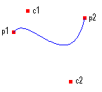
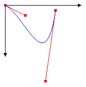
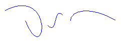

# Bezier Splines

A Bézier spline is a curve specified by four points: two end points (p1 and p2) and two control points (c1 and c2). The curve begins at p1 and ends at p2. The curve doesn't pass through the control points, but the control points act as magnets, pulling the curve in certain directions and influencing the way the curve bends. The following illustration shows a Bézier curve along with its endpoints and control points.



Note that the curve starts at p1 and moves toward the control point c1. The tangent line to the curve at p1 is the line drawn from p1 to c1. Also note that the tangent line at the endpoint p2 is the line drawn from c2 to p2.

To draw a Bézier spline, you need a [**Graphics**](/windows/win32/api/gdiplusgraphics/nl-gdiplusgraphics-graphics) object and a [**Pen**](/windows/win32/api/gdipluspen/nl-gdipluspen-pen) object. The **Graphics** object provides the [DrawBezier](/windows/win32/api/gdiplusgraphics/nf-gdiplusgraphics-graphics-drawbezier(inconstpen_inint_inint_inint_inint_inint_inint_inint_inint)) method, and the **Pen** object stores attributes of the curve, such as line width and color. The address of the **Pen** object is passed as one of the arguments to the DrawBezier method. The remaining arguments passed to the DrawBezier method are the endpoints and the control points. The following example draws a Bézier spline with starting point (0, 0), control points (40, 20) and (80, 150), and ending point (100, 10).


```
myGraphics.DrawBezier(&myPen, 0, 0, 40, 20, 80, 150, 100, 10);
```


The following illustration shows the curve, the control points, and two tangent lines.



Bézier splines were originally developed by Pierre Bézier for design in the automotive industry. They have since proven to be very useful in many types of computer-aided design and are also used to define the outlines of fonts. Bézier splines can yield a wide variety of shapes, some of which are shown in the following illustration.



 

 


