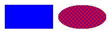
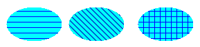
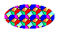
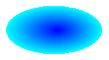
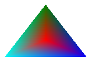

# Brushes and Filled Shapes

A closed figure such as a rectangle or an ellipse consists of an outline and an interior. The outline is drawn with a [**Pen**](-gdiplus-class-pen-class.md) object and the interior is filled with a [**Brush**](-gdiplus-class-brush-class.md) object. Windows GDI+ provides several brush classes for filling the interiors of closed figures: [**SolidBrush**](-gdiplus-class-solidbrush-class.md), [**HatchBrush**](-gdiplus-class-hatchbrush-class.md), [**TextureBrush**](-gdiplus-class-texturebrush-class.md), [**LinearGradientBrush**](-gdiplus-class-lineargradientbrush-class.md), and [**PathGradientBrush**](-gdiplus-class-pathgradientbrush-class.md). All these classes inherit from the **Brush** class. The following illustration shows a rectangle filled with a solid brush and an ellipse filled with a hatch brush.



 

-   [Solid Brushes](#solid-brushes)
-   [Hatch Brushes](#hatch-brushes)
-   [Texture Brushes](#texture-brushes)
-   [Gradient Brushes](#gradient-brushes)

## Solid Brushes

To fill a closed shape, you need a [**Graphics**](-gdiplus-class-graphics-class.md) object and a [**Brush**](-gdiplus-class-brush-class.md) object. The **Graphics** object provides methods, such as [FillRectangle](-gdiplus-class-graphics-fillrectangle-methods.md) and [FillEllipse](-gdiplus-class-graphics-fillellipse-methods.md), and the **Brush** object stores attributes of the fill, such as color and pattern. The address of the **Brush** object is passed as one of the arguments to the fill method. The following example fills an ellipse with a solid red color.


```
SolidBrush mySolidBrush(Color(255, 255, 0, 0));
myGraphics.FillEllipse(&amp;mySolidBrush, 0, 0, 60, 40);
```


Note that in the preceding example, the brush is of type [**SolidBrush**](-gdiplus-class-solidbrush-class.md), which inherits from [**Brush**](-gdiplus-class-brush-class.md).

## Hatch Brushes

When you fill a shape with a hatch brush, you specify a foreground color, a background color, and a hatch style. The foreground color is the color of the hatching.


```
HatchBrush myHatchBrush(
   HatchStyleVertical, 
   Color(255, 0, 0, 255),
   Color(255, 0, 255, 0));
```


GDI+ provides more than 50 hatch styles, specified in [**HatchStyle**](-gdiplus-enum-hatchstyle.md). The three styles shown in the following illustration are Horizontal, ForwardDiagonal, and Cross.



 

## Texture Brushes

With a texture brush, you can fill a shape with a pattern stored in a bitmap. For example, suppose the following picture is stored in a disk file named MyTexture.bmp.


The following example fills an ellipse by repeating the picture stored in MyTexture.bmp.


```
Image myImage(L"MyTexture.bmp");
TextureBrush myTextureBrush(&amp;myImage);
myGraphics.FillEllipse(&amp;myTextureBrush, 0, 0, 100, 50);
```


The following illustration shows the filled ellipse.



 

## Gradient Brushes

You can use a gradient brush to fill a shape with a color that changes gradually from one part of the shape to another. For example, a horizontal gradient brush will change color as you move from the left side of a figure to the right side. The following example fills an ellipse with a horizontal gradient brush that changes from blue to green as you move from the left side of the ellipse to the right side.


```
LinearGradientBrush myLinearGradientBrush(
   myRect,
   Color(255, 0, 0, 255),
   Color(255, 0, 255, 0),
   LinearGradientModeHorizontal);
myGraphics.FillEllipse(&amp;myLinearGradientBrush, myRect); 
```


The following illustration shows the filled ellipse.


A path gradient brush can be configured to change color as you move from the center of a figure toward the boundary.



Path gradient brushes are quite flexible. The gradient brush used to fill the triangle in the following illustration changes gradually from red at the center to each of three different colors at the vertices.



 

 


