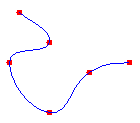

# Cardinal Splines

A cardinal spline is a sequence of individual curves joined to form a larger curve. The spline is specified by an array of points and a tension parameter. A cardinal spline passes smoothly through each point in the array; there are no sharp corners and no abrupt changes in the tightness of the curve. The following illustration shows a set of points and a cardinal spline that passes through each point in the set.



A physical spline is a thin piece of wood or other flexible material. Before the advent of mathematical splines, designers used physical splines to draw curves. A designer would place the spline on a piece of paper and anchor it to a given set of points. The designer could then create a curve by drawing along the spline with a pencil. A given set of points could yield a variety of curves, depending on the properties of the physical spline. For example, a spline with a high resistance to bending would produce a different curve than an extremely flexible spline.

The formulas for mathematical splines are based on the properties of flexible rods, so the curves produced by mathematical splines are similar to the curves that were once produced by physical splines. Just as physical splines of different tension will produce different curves through a given set of points, mathematical splines with different values for the tension parameter will produce different curves through a given set of points. The following illustration shows four cardinal splines passing through the same set of points. The tension is shown for each spline. Note that a tension of 0 corresponds to infinite physical tension, forcing the curve to take the shortest way (straight lines) between points. A tension of 1 corresponds to no physical tension, allowing the spline to take the path of least total bend. With tension values greater than 1, the curve behaves like a compressed spring, pushed to take a longer path.


Note that the four splines in the preceding figure share the same tangent line at the starting point. The tangent is the line drawn from the starting point to the next point along the curve. Likewise, the shared tangent at the ending point is the line drawn from the ending point to the previous point on the curve.

To draw a cardinal spline, you need a [**Graphics**](/windows/win32/api/gdiplusgraphics/nl-gdiplusgraphics-graphics) object, a [**Pen**](/windows/win32/api/gdipluspen/nl-gdipluspen-pen) object, and an array of [**Point**](/windows/win32/api/gdiplustypes/nl-gdiplustypes-point) objects. The **Graphics** object provides the [DrawCurve](/windows/win32/api/gdiplusgraphics/nf-gdiplusgraphics-graphics-drawcurve(inconstpen_inconstpointf_inint_inreal)) method, which draws the spline, and the **Pen** object stores attributes of the spline, such as line width and color. The array of **Point** objects stores the points that the curve will pass through. The following example draws a cardinal spline that passes through the points in *myPointArray*. The third parameter is the tension.


```
myGraphics.DrawCurve(&myPen, myPointArray, 3, 1.5f);
```


 

 


