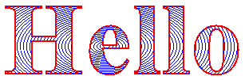

# Clipping

Clipping involves restricting drawing to a certain region. The following illustration shows the string "Hello" clipped to a heart-shaped region.


Regions can be constructed from paths, and paths can contain the outlines of strings, so you can use outlined text for clipping. The following illustration shows a set of concentric ellipses clipped to the interior of a string of text.



To draw with clipping, create a [**Graphics**](-gdiplus-class-graphics-class.md) object, call its [SetClip](-gdiplus-class-graphics-setclip-methods.md) method, and then call the drawing methods of that same **Graphics** object. The following example draws a line that is clipped to a rectangular region.


```
Region myRegion(Rect(20, 30, 100, 50));
myGraphics.DrawRectangle(&amp;myPen, 20, 30, 100, 50);  
myGraphics.SetClip(&amp;myRegion, CombineModeReplace);
myGraphics.DrawLine(&amp;myPen, 0, 0, 200, 200);
```


The following illustration shows the rectangular region along with the clipped line.


 

 


