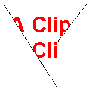

# Clipping with a Region

One of the properties of the [**Graphics**](/windows/desktop/api/gdiplusgraphics/nl-gdiplusgraphics-graphics) class is the clipping region. All drawing done by a given **Graphics** object is restricted to the clipping region of that **Graphics** object. You can set the clipping region by calling the **SetClip** method.

The following example constructs a path that consists of a single polygon. Then the code constructs a region based on that path. The address of the region is passed to the **SetClip** method of a [**Graphics**](/windows/desktop/api/gdiplusgraphics/nl-gdiplusgraphics-graphics) object, and then two strings are drawn.


```
// Create a path that consists of a single polygon.
Point polyPoints[] = {Point(10, 10), Point(150, 10), 
   Point(100, 75), Point(100, 150)};
GraphicsPath path;
path.AddPolygon(polyPoints, 4);
// Construct a region based on the path.
Region region(&path);
// Draw the outline of the region.
Pen pen(Color(255, 0, 0, 0));
graphics.DrawPath(&pen, &path);
// Set the clipping region of the Graphics object.
graphics.SetClip(&region);
// Draw some clipped strings.
FontFamily fontFamily(L"Arial");
Font font(&fontFamily, 36, FontStyleBold, UnitPixel);
SolidBrush solidBrush(Color(255, 255, 0, 0));
graphics.DrawString(L"A Clipping Region", 20, &font, 
   PointF(15, 25), &solidBrush);
graphics.DrawString(L"A Clipping Region", 20, &font, 
   PointF(15, 68), &solidBrush);
```


The following illustration shows the clipped strings.



 

 


