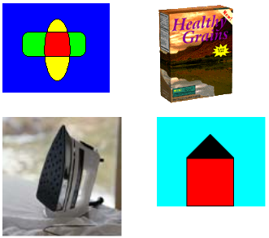

# Copying Individual Frames from a Multiple-Frame Image

The following example retrieves the individual frames from a multiple-frame TIFF file. When the TIFF file was created, the individual frames were added to the Page dimension (see [Creating and Saving a Multiple-Frame Image](-gdiplus-creating-and-saving-a-multiple-frame-image-use.md)). The code displays each of the four pages and saves each page to a separate PNG disk file.

The code constructs an [**Image**](/windows/win32/gdiplusheaders/nl-gdiplusheaders-image?branch=master) object from the multiple-frame TIFF file. To retrieve the individual frames (pages), the code calls the [**Image::SelectActiveFrame**](/windows/win32/Gdiplusheaders/nf-gdiplusheaders-image-selectactiveframe?branch=master) method of that **Image** object. The first argument passed to the **Image::SelectActiveFrame** method is the address of a GUID that specifies the dimension in which the frames were previously added to the multiple-frame TIFF file. The GUID FrameDimensionPage is defined in Gdiplusimaging.h. Other GUIDs defined in that header file are FrameDimensionTime and FrameDimensionResolution. The second argument passed to the **Image::SelectActiveFrame** method is the zero-based index of the desired page.

The code relies on the helper function GetEncoderClsid, which is shown in [Retrieving the Class Identifier for an Encoder](-gdiplus-retrieving-the-class-identifier-for-an-encoder-use.md).


```
GUID   pageGuid = FrameDimensionPage;
CLSID  encoderClsid;
Image  multi(L"Multiframe.tif");

// Get the CLSID of the PNG encoder.
GetEncoderClsid(L"image/png", &amp;encoderClsid);

// Display and save the first page (index 0).
multi.SelectActiveFrame(&amp;pageGuid, 0);
graphics.DrawImage(&amp;multi, 10, 10);
multi.Save(L"Page0.png", &amp;encoderClsid, NULL);

// Display and save the second page.
multi.SelectActiveFrame(&amp;pageGuid, 1);
graphics.DrawImage(&amp;multi, 200, 10);
multi.Save(L"Page1.png", &amp;encoderClsid, NULL);

// Display and save the third page.
multi.SelectActiveFrame(&amp;pageGuid, 2);
graphics.DrawImage(&amp;multi, 10, 150);
multi.Save(L"Page2.png", &amp;encoderClsid, NULL);

// Display and save the fourth page.
multi.SelectActiveFrame(&amp;pageGuid, 3);
graphics.DrawImage(&amp;multi, 200, 150);
multi.Save(L"Page3.png", &amp;encoderClsid, NULL);
```


The following illustration shows the individual pages as displayed by the preceding code.



 

 


