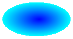
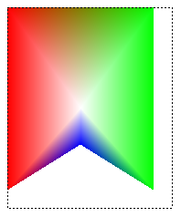
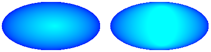
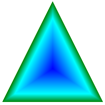
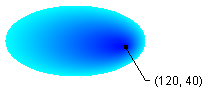
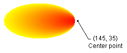

# Creating a Path Gradient

The [**PathGradientBrush**](/windows/desktop/api/gdipluspath/nl-gdipluspath-pathgradientbrush) class allows you to customize the way you fill a shape with gradually changing colors. A **PathGradientBrush** object has a boundary path and a center point. You can specify one color for the center point and another color for the boundary. You can also specify separate colors for each of several points along the boundary.

> [!Note]  
> In GDI+, a path is a sequence of lines and curves maintained by a [**GraphicsPath**](/windows/desktop/api/gdipluspath/nl-gdipluspath-graphicspath) object. For more information about GDI+ paths, see [Paths](-gdiplus-paths-about.md) and [Constructing and Drawing Paths](-gdiplus-constructing-and-drawing-paths-use.md).

 

The following example fills an ellipse with a path gradient brush. The center color is set to blue and the boundary color is set to aqua.


```
// Create a path that consists of a single ellipse.
GraphicsPath path;
path.AddEllipse(0, 0, 140, 70);

// Use the path to construct a brush.
PathGradientBrush pthGrBrush(&path);

// Set the color at the center of the path to blue.
pthGrBrush.SetCenterColor(Color(255, 0, 0, 255));

// Set the color along the entire boundary of the path to aqua.
Color colors[] = {Color(255, 0, 255, 255)};
int count = 1;
pthGrBrush.SetSurroundColors(colors, &count);

graphics.FillEllipse(&pthGrBrush, 0, 0, 140, 70);
```


The following illustration shows the filled ellipse.



By default, a path gradient brush does not extend outside the boundary of the path. If you use the path gradient brush to fill a shape that extends beyond the boundary of the path, the area of the screen outside the path will not be filled. The following illustration shows what happens if you change the [**Graphics::FillEllipse**](/windows/win32/api/gdiplusgraphics/nf-gdiplusgraphics-graphics-fillellipse(inconstbrush_inreal_inreal_inreal_inreal)) call in the preceding code to `graphics.FillRectangle(&pthGrBrush, 0, 10, 200, 40)`.


## Specifying Points on the Boundary

The following example constructs a path gradient brush from a star-shaped path. The code calls the [**PathGradientBrush::SetCenterColor**](/windows/desktop/api/Gdipluspath/nf-gdipluspath-pathgradientbrush-setcentercolor) method to set the color at the centroid of the star to red. Then the code calls the [**PathGradientBrush::SetSurroundColors**](/windows/desktop/api/Gdipluspath/nf-gdipluspath-pathgradientbrush-setsurroundcolors) method to specify various colors (stored in the [**colors**](/windows/desktop/api/gdipluscolor/nl-gdipluscolor-color) array) at the individual points in the [**points**](/windows/desktop/api/gdiplustypes/nl-gdiplustypes-point) array. The final code statement fills the star-shaped path with the path gradient brush.


```
// Put the points of a polygon in an array.
Point points[] = {Point(75, 0),    Point(100, 50), 
                  Point(150, 50),  Point(112, 75),
                  Point(150, 150), Point(75, 100), 
                  Point(0, 150),   Point(37, 75), 
                  Point(0, 50),    Point(50, 50)};

// Use the array of points to construct a path.
GraphicsPath path;
path.AddLines(points, 10);

// Use the path to construct a path gradient brush.
PathGradientBrush pthGrBrush(&path);

// Set the color at the center of the path to red.
pthGrBrush.SetCenterColor(Color(255, 255, 0, 0));

// Set the colors of the points in the array.
Color colors[] = {Color(255, 0, 0, 0),   Color(255, 0, 255, 0),
                  Color(255, 0, 0, 255), Color(255, 255, 255, 255), 
                  Color(255, 0, 0, 0),   Color(255, 0, 255, 0), 
                  Color(255, 0, 0, 255), Color(255, 255, 255, 255),
                  Color(255, 0, 0, 0),   Color(255, 0, 255, 0)};

int count = 10;
pthGrBrush.SetSurroundColors(colors, &count);

// Fill the path with the path gradient brush.
graphics.FillPath(&pthGrBrush, &path);
```


The following illustration shows the filled star.


The following example constructs a path gradient brush based on an array of points. A color is assigned to each of the five points in the array. If you were to connect the five points by straight lines, you would get a five-sided polygon. A color is also assigned to the center (centroid) of that polygon — in this example, the center (80, 75) is set to white. The final code statement in the example fills a rectangle with the path gradient brush.

The color used to fill the rectangle is white at (80, 75) and changes gradually as you move away from (80, 75) toward the points in the array. For example, as you move from (80, 75) to (0, 0), the color changes gradually from white to red, and as you move from (80, 75) to (160, 0), the color changes gradually from white to green.


```
// Construct a path gradient brush based on an array of points.
PointF ptsF[] = {PointF(0.0f, 0.0f), 
                 PointF(160.0f, 0.0f), 
                 PointF(160.0f, 200.0f),
                 PointF(80.0f, 150.0f),
                 PointF(0.0f, 200.0f)};

PathGradientBrush pBrush(ptsF, 5);

// An array of five points was used to construct the path gradient
// brush. Set the color of each point in that array.
Color colors[] = {Color(255, 255, 0, 0),  // (0, 0) red
                  Color(255, 0, 255, 0),  // (160, 0) green
                  Color(255, 0, 255, 0),  // (160, 200) green
                  Color(255, 0, 0, 255),  // (80, 150) blue
                  Color(255, 255, 0, 0)}; // (0, 200) red

int count = 5;
pBrush.SetSurroundColors(colors, &count);

// Set the center color to white.
pBrush.SetCenterColor(Color(255, 255, 255, 255));

// Use the path gradient brush to fill a rectangle.
graphics.FillRectangle(&pBrush, Rect(0, 0, 180, 220));
```


Note that there is no [**GraphicsPath**](/windows/desktop/api/gdipluspath/nl-gdipluspath-graphicspath) object in the preceding code. The particular [**PathGradientBrush**](/windows/desktop/api/gdipluspath/nl-gdipluspath-pathgradientbrush) constructor in the example receives a pointer to an array of points but does not require a **GraphicsPath** object. Also, note that the path gradient brush is used to fill a rectangle, not a path. The rectangle is larger than the path used to define the brush, so some of the rectangle is not painted by the brush. The following illustration shows the rectangle (dotted line) and the portion of the rectangle painted by the path gradient brush.



## Customizing a Path Gradient

One way to customize a path gradient brush is to set its focus scales. The focus scales specify an inner path that lies inside the main path. The center color is displayed everywhere inside that inner path rather than only at the center point. To set the focus scales of a path gradient brush, call the [**PathGradientBrush::SetFocusScales**](/windows/desktop/api/Gdipluspath/nf-gdipluspath-pathgradientbrush-setfocusscales) method.

The following example creates a path gradient brush based on an elliptical path. The code sets the boundary color to blue, sets the center color to aqua, and then uses the path gradient brush to fill the elliptical path.

Next the code sets the focus scales of the path gradient brush. The x focus scale is set to 0.3, and the y focus scale is set to 0.8. The code calls the [**Graphics::TranslateTransform**](/windows/desktop/api/Gdiplusgraphics/nf-gdiplusgraphics-graphics-translatetransform) method of a [**Graphics**](/windows/desktop/api/gdiplusgraphics/nl-gdiplusgraphics-graphics) object so that the subsequent call to [**Graphics::FillPath**](/windows/desktop/api/Gdiplusgraphics/nf-gdiplusgraphics-graphics-fillpath) fills an ellipse that sits to the right of the first ellipse.

To see the effect of the focus scales, imagine a small ellipse that shares its center with the main ellipse. The small (inner) ellipse is the main ellipse scaled (about its center) horizontally by a factor of 0.3 and vertically by a factor of 0.8. As you move from the boundary of the outer ellipse to the boundary of the inner ellipse, the color changes gradually from blue to aqua. As you move from the boundary of the inner ellipse to the shared center, the color remains aqua.


```
// Create a path that consists of a single ellipse.
GraphicsPath path;
path.AddEllipse(0, 0, 200, 100);

// Create a path gradient brush based on the elliptical path.
PathGradientBrush pthGrBrush(&path);
pthGrBrush.SetGammaCorrection(TRUE);

// Set the color along the entire boundary to blue.
Color color(Color(255, 0, 0, 255));
INT num = 1;
pthGrBrush.SetSurroundColors(&color, &num);

// Set the center color to aqua.
pthGrBrush.SetCenterColor(Color(255, 0, 255, 255));
 
// Use the path gradient brush to fill the ellipse. 
graphics.FillPath(&pthGrBrush, &path);

// Set the focus scales for the path gradient brush.
pthGrBrush.SetFocusScales(0.3f, 0.8f);

// Use the path gradient brush to fill the ellipse again.
// Show this filled ellipse to the right of the first filled ellipse.
graphics.TranslateTransform(220.0f, 0.0f);
graphics.FillPath(&pthGrBrush, &path);
```


The following illustration shows the output of the preceding code. The ellipse on the left is aqua only at the center point. The ellipse on the right is aqua everywhere inside the inner path.



Another way to customize a path gradient brush is to specify an array of preset colors and an array of interpolation positions.

The following example creates a path gradient brush based on a triangle. The code calls the [**PathGradientBrush::SetInterpolationColors**](/windows/desktop/api/Gdipluspath/nf-gdipluspath-pathgradientbrush-setinterpolationcolors) method of the path gradient brush to specify an array of interpolation colors (dark green, aqua, blue) and an array of interpolation positions (0, 0.25, 1). As you move from the boundary of the triangle to the center point, the color changes gradually from dark green to aqua and then from aqua to blue. The change from dark green to aqua happens in 25 percent of the distance from dark green to blue.


```
// Vertices of the triangle
Point points[] = {Point(100, 0), 
                  Point(200, 200), 
                  Point(0, 200)};

// No GraphicsPath object is created. The PathGradient
// brush is constructed directly from the array of points.
PathGradientBrush pthGrBrush(points, 3);

Color presetColors[] = {
   Color(255, 0, 128, 0),    // Dark green
   Color(255, 0, 255, 255),  // Aqua
   Color(255, 0, 0, 255)};   // Blue

REAL interpPositions[] = {
   0.0f,   // Dark green is at the boundary of the triangle.
   0.25f,  // Aqua is 25 percent of the way from the boundary
           // to the center point.
   1.0f};  // Blue is at the center point.
                  
pthGrBrush.SetInterpolationColors(presetColors, interpPositions, 3);

// Fill a rectangle that is larger than the triangle
// specified in the Point array. The portion of the
// rectangle outside the triangle will not be painted.
graphics.FillRectangle(&pthGrBrush, 0, 0, 200, 200);
```


The following illustration shows the output of the preceding code.



## Setting the Center Point

By default, the center point of a path gradient brush is at the centroid of the path used to construct the brush. You can change the location of the center point by calling the [**PathGradientBrush::SetCenterPoint**](/windows/win32/api/gdipluspath/nf-gdipluspath-pathgradientbrush-setcenterpoint(inconstpoint_)) method of the [**PathGradientBrush**](/windows/desktop/api/gdipluspath/nl-gdipluspath-pathgradientbrush) class.

The following example creates a path gradient brush based on an ellipse. The center of the ellipse is at (70, 35), but the center point of the path gradient brush is set to (120, 40).


```
// Create a path that consists of a single ellipse.
GraphicsPath path;
path.AddEllipse(0, 0, 140, 70);

// Use the path to construct a brush.
PathGradientBrush pthGrBrush(&path);

// Set the center point to a location that is not the centroid of the path.
pthGrBrush.SetCenterPoint(Point(120, 40));

// Set the color at the center point to blue.
pthGrBrush.SetCenterColor(Color(255, 0, 0, 255));

// Set the color along the entire boundary of the path to aqua.
Color colors[] = {Color(255, 0, 255, 255)};
int count = 1;
pthGrBrush.SetSurroundColors(colors, &count);

graphics.FillEllipse(&pthGrBrush, 0, 0, 140, 70);
```


The following illustration shows the filled ellipse and the center point of the path gradient brush.



You can set the center point of a path gradient brush to a location outside the path that was used to construct the brush. In the preceding code, if you replace the call to [**PathGradientBrush::SetCenterPoint**](/windows/win32/api/gdipluspath/nf-gdipluspath-pathgradientbrush-setcenterpoint(inconstpoint_)) with `pthGrBrush.SetCenterPoint(Point(145, 35))`, you will get the following result.



In the preceding illustration, the points at the far right of the ellipse are not pure blue (although they are very close). The colors in the gradient are positioned as if the fill had been allowed to reach the point (145, 35), the color would have reached pure blue (0, 0, 255). But the fill never reaches (145, 35) because a path gradient brush paints only inside its path.

 

 
