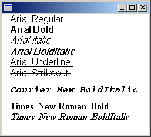

# Creating a Private Font Collection

The [**PrivateFontCollection**](/windows/win32/api/gdiplusheaders/nl-gdiplusheaders-privatefontcollection) class inherits from the [**FontCollection**](/windows/win32/api/gdiplusheaders/nl-gdiplusheaders-fontcollection) abstract base class. You can use a **PrivateFontCollection** object to maintain a set of fonts specifically for your application.

A private font collection can include installed system fonts as well as fonts that have not been installed on the computer. To add a font file to a private font collection, call the [**PrivateFontCollection::AddFontFile**](/windows/win32/api/Gdiplusheaders/nf-gdiplusheaders-privatefontcollection-addfontfile) method of a [**PrivateFontCollection**](/windows/win32/api/gdiplusheaders/nl-gdiplusheaders-privatefontcollection) object.

> [!Note]  
> When you use the GDI+ API, you must never allow your application to download arbitrary fonts from untrusted sources. The operating system requires elevated privileges to assure that all installed fonts are trusted.

 

The [**FontCollection::GetFamilies**](/windows/win32/api/Gdiplusheaders/nf-gdiplusheaders-fontcollection-getfamilies) method of a [**PrivateFontCollection**](/windows/win32/api/gdiplusheaders/nl-gdiplusheaders-privatefontcollection) object returns an array of [**FontFamily**](/windows/win32/api/gdiplusheaders/nl-gdiplusheaders-fontfamily) objects. Before you call **FontCollection::GetFamilies**, you must allocate a buffer large enough to hold that array. To determine the size of the required buffer, call the [**FontCollection::GetFamilyCount**](/windows/win32/api/Gdiplusheaders/nf-gdiplusheaders-fontcollection-getfamilycount) method and multiply the return value by **sizeof**(**FontFamily**).

The number of font families in a private font collection is not necessarily the same as the number of font files that have been added to the collection. For example, suppose you add the files ArialBd.tff, Times.tff, and TimesBd.tff to a collection. There will be three files but only two families in the collection because Times.tff and TimesBd.tff belong to the same family.

The following example adds the following three font files to a [**PrivateFontCollection**](/windows/win32/api/gdiplusheaders/nl-gdiplusheaders-privatefontcollection) object:

-   C:\\WINNT\\Fonts\\Arial.tff (Arial, regular)
-   C:\\WINNT\\Fonts\\CourBI.tff (Courier New, bold italic)
-   C:\\WINNT\\Fonts\\TimesBd.tff (Times New Roman, bold)

The code calls the [**FontCollection::GetFamilyCount**](/windows/win32/api/Gdiplusheaders/nf-gdiplusheaders-fontcollection-getfamilycount) method of the [**PrivateFontCollection**](/windows/win32/api/gdiplusheaders/nl-gdiplusheaders-privatefontcollection) object to determine the number of families in the private collection, and then calls [**FontCollection::GetFamilies**](/windows/win32/api/Gdiplusheaders/nf-gdiplusheaders-fontcollection-getfamilies) to retrieve an array of [**FontFamily**](/windows/win32/api/gdiplusheaders/nl-gdiplusheaders-fontfamily) objects.

For each [**FontFamily**](/windows/win32/api/gdiplusheaders/nl-gdiplusheaders-fontfamily) object in the collection, the code calls the [**FontFamily::IsStyleAvailable**](/windows/win32/api/Gdiplusheaders/nf-gdiplusheaders-fontfamily-isstyleavailable) method to determine whether various styles (regular, bold, italic, bold italic, underline, and strikeout) are available. The arguments passed to the **FontFamily::IsStyleAvailable** method are members of the [**FontStyle**](/windows/win32/api/Gdiplusenums/ne-gdiplusenums-fontstyle) enumeration, which is declared in Gdiplusenums.h.

If a particular family/style combination is available, a [**Font**](/windows/win32/api/gdiplusheaders/nl-gdiplusheaders-font) object is constructed using that family and style. The first argument passed to the **Font** constructor is the font family name (not a [**FontFamily**](/windows/win32/api/gdiplusheaders/nl-gdiplusheaders-fontfamily) object as is the case for other variations of the **Font** constructor), and the final argument is the address of the [**PrivateFontCollection**](/windows/win32/api/gdiplusheaders/nl-gdiplusheaders-privatefontcollection) object. After the **Font** object is constructed, its address is passed to the [DrawString](/windows/win32/api/gdiplusgraphics/nf-gdiplusgraphics-graphics-drawstring(constwchar_int_constfont_constpointf__constbrush)) method of the [**Graphics**](/windows/win32/api/gdiplusgraphics/nl-gdiplusgraphics-graphics) class to display the family name along with the name of the style.


```
#define MAX_STYLE_SIZE 20
#define MAX_FACEANDSTYLE_SIZE (LF_FACESIZE + MAX_STYLE_SIZE + 2)

PointF      pointF(10.0f, 0.0f);
SolidBrush  solidBrush(Color(255, 0, 0, 0));
INT                   count = 0;
INT                   found = 0;
WCHAR                 familyName[LF_FACESIZE];
WCHAR                 familyNameAndStyle[MAX_FACEANDSTYLE_SIZE]; 
FontFamily*           pFontFamily;
PrivateFontCollection privateFontCollection;

// Add three font files to the private collection.
privateFontCollection.AddFontFile(L"c:\\Winnt\\Fonts\\Arial.ttf");
privateFontCollection.AddFontFile(L"c:\\Winnt\\Fonts\\CourBI.ttf");
privateFontCollection.AddFontFile(L"c:\\Winnt\\Fonts\\TimesBd.ttf");

// How many font families are in the private collection?
count = privateFontCollection.GetFamilyCount();

// Allocate a buffer to hold the array of FontFamily
// objects returned by GetFamilies.
pFontFamily = new FontFamily[count];

// Get the array of FontFamily objects.
privateFontCollection.GetFamilies(count, pFontFamily, &found);

// Display the name of each font family in the private collection
// along with the available styles for that font family.
for(INT j = 0; j < count; ++j)
{
   // Get the font family name.
   pFontFamily[j].GetFamilyName(familyName);
   
   // Is the regular style available?
   if(pFontFamily[j].IsStyleAvailable(FontStyleRegular))
   {
      StringCchCopyW(familyNameAndStyle, LF_FACESIZE, familyName);
      StringCchCatW(familyNameAndStyle, MAX_FACEANDSTYLE_SIZE, L" Regular");

      Font* pFont = new Font(
         familyName, 16, FontStyleRegular, UnitPixel, &privateFontCollection);

      graphics.DrawString(familyNameAndStyle, -1, pFont, pointF, &solidBrush);

      pointF.Y += pFont->GetHeight(0.0f);
      delete(pFont);      
   }

   // Is the bold style available?
   if(pFontFamily[j].IsStyleAvailable(FontStyleBold))
   {
      StringCchCopyW(familyNameAndStyle, LF_FACESIZE, familyName);
      StringCchCatW(familyNameAndStyle, MAX_FACEANDSTYLE_SIZE, L" Bold");

      Font* pFont = new Font(
         familyName, 16, FontStyleBold, UnitPixel, &privateFontCollection);

      graphics.DrawString(familyNameAndStyle, -1, pFont, pointF, &solidBrush);

      pointF.Y += pFont->GetHeight(0.0f);
      delete(pFont);
   }

   // Is the italic style available?
   if(pFontFamily[j].IsStyleAvailable(FontStyleItalic))
   {
      StringCchCopyW(familyNameAndStyle, LF_FACESIZE, familyName);
      StringCchCatW(familyNameAndStyle, MAX_FACEANDSTYLE_SIZE, L" Italic");

      Font* pFont = new Font(
         familyName, 16, FontStyleItalic, UnitPixel, &privateFontCollection);

      graphics.DrawString(familyNameAndStyle, -1, pFont, pointF, &solidBrush);

      pointF.Y += pFont->GetHeight(0.0f);
      delete(pFont);
   }

   // Is the bold italic style available?
   if(pFontFamily[j].IsStyleAvailable(FontStyleBoldItalic))
   {
      StringCchCopyW(familyNameAndStyle, LF_FACESIZE, familyName);
      StringCchCatW(familyNameAndStyle, MAX_FACEANDSTYLE_SIZE, L" BoldItalic");

      Font* pFont = new Font(familyName, 16, 
         FontStyleBoldItalic, UnitPixel, &privateFontCollection);

      graphics.DrawString(familyNameAndStyle, -1, pFont, pointF, &solidBrush);

      pointF.Y += pFont->GetHeight(0.0f);
      delete(pFont);
    }

   // Is the underline style available?
   if(pFontFamily[j].IsStyleAvailable(FontStyleUnderline))
   {
      StringCchCopyW(familyNameAndStyle, LF_FACESIZE, familyName);
      StringCchCatW(familyNameAndStyle, MAX_FACEANDSTYLE_SIZE, L" Underline");

      Font* pFont = new Font(familyName, 16, 
         FontStyleUnderline, UnitPixel, &privateFontCollection);

      graphics.DrawString(familyNameAndStyle, -1, pFont, pointF, &solidBrush);

      pointF.Y += pFont->GetHeight(0.0);
      delete(pFont);
   }
 
   // Is the strikeout style available?
   if(pFontFamily[j].IsStyleAvailable(FontStyleStrikeout))
   {
      StringCchCopyW(familyNameAndStyle, LF_FACESIZE, familyName);
      StringCchCatW(familyNameAndStyle, MAX_FACEANDSTYLE_SIZE, L" Strikeout");

      Font* pFont = new Font(familyName, 16, 
         FontStyleStrikeout, UnitPixel, &privateFontCollection);

      graphics.DrawString(familyNameAndStyle, -1, pFont, pointF, &solidBrush);

      pointF.Y += pFont->GetHeight(0.0f);
      delete(pFont);
   }

   // Separate the families with white space.
   pointF.Y += 10.0f;

} // for

delete pFontFamily;
            
```


The following illustration shows the output of the preceding code.



Arial.tff (which was added to the private font collection in the preceding code example) is the font file for the Arial regular style. Note, however, that the program output shows several available styles other than regular for the Arial font family. That is because Windows GDI+ can simulate the bold, italic, and bold italic styles from the regular style. GDI+ can also produce underlines and strikeouts from the regular style.

Similarly, GDI+ can simulate the bold italic style from either the bold style or the italic style. The program output shows that the bold italic style is available for the Times family even though TimesBd.tff (Times New Roman, bold) is the only Times file in the collection.

This table specifies the non-system fonts that GDI+ supports.


|                     | GDI | GDI+ on Windows 7 | GDI+ on Windows 8 | DirectWrite |
|---------------------|-----|-------------------|-------------------|-------------|
| .FON                | yes | no                | no                | no          |
| .FNT                | yes | no                | no                | no          |
| .TTF                | yes | yes               | yes               | yes         |
| .OTF with TrueType  | yes | yes               | yes               | yes         |
| .OTF with Adobe CFF | yes | no                | yes               | yes         |
| Adobe Type 1        | yes | no                | no                | no          |


 

 

 


