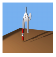

# Creating Thumbnail Images

A thumbnail image is a small version of an image. You can create a thumbnail image by calling the **GetThumbnailImage** method of an [**Image**](/windows/desktop/api/gdiplusheaders/nl-gdiplusheaders-image) object.

The following example constructs an [**Image**](/windows/desktop/api/gdiplusheaders/nl-gdiplusheaders-image) object from the file Compass.bmp. The original image has a width of 640 pixels and a height of 479 pixels. The code creates a thumbnail image that has a width of 100 pixels and a height of 100 pixels.


```
Image image(L"Compass.bmp");
Image* pThumbnail = image.GetThumbnailImage(100, 100, NULL, NULL);
graphics.DrawImage(pThumbnail, 10, 10, 
   pThumbnail->GetWidth(), pThumbnail->GetHeight());
```


The following illustration shows the thumbnail image.



 

 


