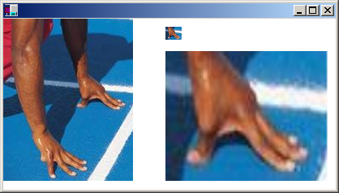

# About cropping and scaling GDI+ images

You can use the [DrawImage](/windows/win32/api/gdiplusgraphics/nf-gdiplusgraphics-graphics-drawimage(inimage_inconstrect_)) method of the [**Graphics**](/windows/win32/api/gdiplusgraphics/nl-gdiplusgraphics-graphics) class to draw and position images. DrawImage is an overloaded method, so there are several ways you can supply it with arguments. One variation of the [**Graphics::DrawImage**](/windows/win32/api/gdiplusgraphics/nf-gdiplusgraphics-graphics-drawimage(inimage_inconstrect_)) method receives the address of an [**Image**](/windows/win32/api/gdiplusheaders/nl-gdiplusheaders-image) object and a reference to a [**Rect**](/windows/win32/api/gdiplustypes/nl-gdiplustypes-rect) object. The rectangle specifies the destination for the drawing operation; that is, it specifies the rectangle in which the image will be drawn. If the size of the destination rectangle is different from the size of the original image, the image is scaled to fit the destination rectangle. The following example draws the same image three times: once with no scaling, once with an expansion, and once with a compression.


```
Bitmap myBitmap(L"Spiral.png");
Rect expansionRect(80, 10, 2 * myBitmap.GetWidth(), myBitmap.GetHeight());
Rect compressionRect(210, 10, myBitmap.GetWidth() / 2, 
   myBitmap.GetHeight() / 2);

myGraphics.DrawImage(&myBitmap, 10, 10);
myGraphics.DrawImage(&myBitmap, expansionRect);
myGraphics.DrawImage(&myBitmap, compressionRect);
```


The preceding code, along with a particular file, Spiral.png, produced the following output.


Some variations of the [**Graphics::DrawImage**](/windows/win32/api/gdiplusgraphics/nf-gdiplusgraphics-graphics-drawimage(inimage_inconstrect_)) method have a source-rectangle parameter as well as a destination-rectangle parameter. The source rectangle specifies the portion of the original image that will be drawn. The destination rectangle specifies where that portion of the image will be drawn. If the size of the destination rectangle is different from the size of the source rectangle, the image is scaled to fit the destination rectangle.

The following example constructs a [**Bitmap**](/windows/win32/api/gdiplusheaders/nl-gdiplusheaders-bitmap) object from the file Runner.jpg. The entire image is drawn with no scaling at (0, 0). Then a small portion of the image is drawn twice: once with a compression and once with an expansion.


```
Bitmap myBitmap(L"Runner.jpg"); 

// The rectangle (in myBitmap) with upper-left corner (80, 70), 
// width 80, and height 45, encloses one of the runner's hands.

// Small destination rectangle for compressed hand.
Rect destRect1(200, 10, 20, 16);

// Large destination rectangle for expanded hand.
Rect destRect2(200, 40, 200, 160);

// Draw the original image at (0, 0).
myGraphics.DrawImage(&myBitmap, 0, 0);

// Draw the compressed hand.
myGraphics.DrawImage(
   &myBitmap, destRect1, 80, 70, 80, 45, UnitPixel);

// Draw the expanded hand. 
myGraphics.DrawImage(
   &myBitmap, destRect2, 80, 70, 80, 45, UnitPixel);
```


The following illustration shows the unscaled image, and the compressed and expanded image portions.



 

 


