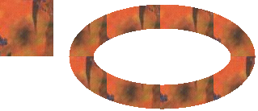

# Drawing a Line Filled with a Texture

Instead of drawing a line or curve with a solid color, you can draw with a texture. To draw lines and curves with a texture, create a [**TextureBrush**](-gdiplus-class-texturebrush-class.md) object, and pass the address of that **TextureBrush** object to a [**Pen**](-gdiplus-class-pen-class.md) constructor. The image associated with the texture brush is used to tile the plane (invisibly), and when the pen draws a line or curve, the stroke of the pen uncovers certain pixels of the tiled texture.

The following example creates an [**Image**](-gdiplus-class-image-class.md) object from the file Texture1.jpg. That image is used to construct a [**TextureBrush**](-gdiplus-class-texturebrush-class.md) object, and the **TextureBrush** object is used to construct a [**Pen**](-gdiplus-class-pen-class.md) object. The call to [**Graphics::DrawImage**](-gdiplus-class-graphics-drawimage-image-image-int-x-int-y-int-width-int-height-.md) draws the image with its upper-left corner at (0, 0). The call to [**Graphics::DrawEllipse**](-gdiplus-class-graphics-drawellipse-pen-pen-int-x-int-y-int-width-int-height-.md) uses the **Pen** object to draw a textured ellipse.


```
Image         image(L"Texture1.jpg");
TextureBrush  tBrush(&amp;image);
Pen           texturedPen(&amp;tBrush, 30);

graphics.DrawImage(&amp;image, 0, 0, image.GetWidth(), image.GetHeight());
graphics.DrawEllipse(&amp;texturedPen, 100, 20, 200, 100);
```


The following illustration shows the image and the textured ellipse.



 

 


