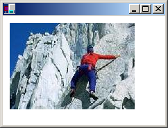

# Drawing, Positioning, and Cloning Images

You can use the [**Image**](/windows/win32/api/gdiplusheaders/nl-gdiplusheaders-image) class to load and display raster images (bitmaps) and vector images (metafiles). To display an image, you need a [**Graphics**](/windows/win32/api/gdiplusgraphics/nl-gdiplusgraphics-graphics) object and an **Image** object. The **Graphics** object provides the [**Graphics::DrawImage**](/windows/win32/api/gdiplusgraphics/nf-gdiplusgraphics-graphics-drawimage(inimage_inint_inint)) method, which receives the address of the **Image** object as an argument.

The following example constructs an [**Image**](/windows/win32/api/gdiplusheaders/nl-gdiplusheaders-image) object from the file Climber.jpg and then displays the image. The destination point for the upper-left corner of the image, (10, 10), is specified in the second and third parameters of the [**Graphics::DrawImage**](/windows/win32/api/gdiplusgraphics/nf-gdiplusgraphics-graphics-drawimage(inimage_inint_inint)) method.


```
Image myImage(L"Climber.jpg");
myGraphics.DrawImage(&myImage, 10, 10);
```


The preceding code, along with a particular file, Climber.jpg, produced the following output.



You can construct [**Image**](/windows/win32/api/gdiplusheaders/nl-gdiplusheaders-image) objects from a variety of graphics file formats: BMP, GIF, JPEG, Exif, PNG, TIFF, WMF, EMF, and ICON.

The following example constructs [**Image**](/windows/win32/api/gdiplusheaders/nl-gdiplusheaders-image) objects from a variety of file types and then displays the images.


```
Image myBMP(L"SpaceCadet.bmp");
Image myEMF(L"Metafile1.emf");
Image myGIF(L"Soda.gif");
Image myJPEG(L"Mango.jpg");
Image myPNG(L"Flowers.png");
Image myTIFF(L"MS.tif");

myGraphics.DrawImage(&myBMP, 10, 10);
myGraphics.DrawImage(&myEMF, 220, 10);
myGraphics.DrawImage(&myGIF, 320, 10);
myGraphics.DrawImage(&myJPEG, 380, 10);
myGraphics.DrawImage(&myPNG, 150, 200);
myGraphics.DrawImage(&myTIFF, 300, 200);
```


The [**Image**](/windows/win32/api/gdiplusheaders/nl-gdiplusheaders-image) class provides a [**Image::Clone**](/windows/win32/api/Gdiplusheaders/nf-gdiplusheaders-image-clone) method that you can use to make a copy of an existing **Image**, [**Metafile**](/windows/win32/api/gdiplusheaders/nl-gdiplusheaders-metafile), or [**Bitmap**](/windows/win32/api/gdiplusheaders/nl-gdiplusheaders-bitmap) object. The [Clone](/windows/win32/api/gdiplusheaders/nf-gdiplusheaders-bitmap-clone(inconstrectf__inpixelformat)) method is overloaded in the **Bitmap** class, and one of the variations has a source-rectangle parameter that you can use to specify the portion of the original image that you want to copy. The following example creates a **Bitmap** object by cloning the top half of an existing **Bitmap** object. Then both images are displayed.


```
Bitmap* originalBitmap = new Bitmap(L"Spiral.png");
RectF sourceRect(
   0.0f,
   0.0f, 
   (REAL)(originalBitmap->GetWidth()), 
   (REAL)(originalBitmap->GetHeight())/2.0f);

Bitmap* secondBitmap = originalBitmap->Clone(sourceRect, PixelFormatDontCare);

myGraphics.DrawImage(originalBitmap, 10, 10);
myGraphics.DrawImage(secondBitmap, 100, 10);
```


The preceding code, along with a particular file, Spiral.png, produced the following output.


 

 
