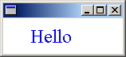
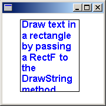

# Drawing Text (GDI+)

You can use the [DrawString](/windows/win32/api/gdiplusgraphics/nf-gdiplusgraphics-graphics-drawstring(constwchar_int_constfont_constpointf__constbrush)) method of the [**Graphics**](/windows/desktop/api/gdiplusgraphics/nl-gdiplusgraphics-graphics) class to draw text at a specified location or within a specified rectangle.

-   [Drawing Text at a Specified Location](#drawing-text-at-a-specified-location)
-   [Drawing Text in a Rectangle](#drawing-text-in-a-rectangle)

## Drawing Text at a Specified Location

To draw text at a specified location, you need [**Graphics**](/windows/desktop/api/gdiplusgraphics/nl-gdiplusgraphics-graphics), [**FontFamily**](/windows/desktop/api/gdiplusheaders/nl-gdiplusheaders-fontfamily), [**Font**](/windows/desktop/api/gdiplusheaders/nl-gdiplusheaders-font), [**PointF**](/windows/desktop/api/gdiplustypes/nl-gdiplustypes-pointf), and [**Brush**](/windows/desktop/api/gdiplusbrush/nl-gdiplusbrush-brush) objects.

The following example draws the string "Hello" at location (30, 10). The font family is Times New Roman. The font, which is an individual member of the font family, is Times New Roman, size 24 pixels, regular style. Assume that **graphics** is an existing [**Graphics**](/windows/desktop/api/gdiplusgraphics/nl-gdiplusgraphics-graphics) object.

```
FontFamily  fontFamily(L"Times New Roman");
Font        font(&fontFamily, 24, FontStyleRegular, UnitPixel);
PointF      pointF(30.0f, 10.0f);
SolidBrush  solidBrush(Color(255, 0, 0, 255));

graphics.DrawString(L"Hello", -1, &font, pointF, &solidBrush);

```

The following illustration shows the output of the preceding code.



In the preceding example, the [**FontFamily**](/windows/desktop/api/gdiplusheaders/nl-gdiplusheaders-fontfamily) constructor receives a string that identifies the font family. The address of the **FontFamily** object is passed as the first argument to the [**Font**](/windows/desktop/api/gdiplusheaders/nl-gdiplusheaders-font) constructor. The second argument passed to the **Font** constructor specifies the size of the font measured in units given by the fourth argument. The third argument specifies the style (regular, bold, italic, and so on) of the font.

The [DrawString](/windows/win32/api/gdiplusgraphics/nf-gdiplusgraphics-graphics-drawstring(constwchar_int_constfont_constpointf__constbrush)) method receives five arguments. The first argument is the string to be drawn, and the second argument is the length (in characters, not bytes) of that string. If the string is null-terminated, you can pass –1 for the length. The third argument is the address of the [**Font**](/windows/desktop/api/gdiplusheaders/nl-gdiplusheaders-font) object that was constructed previously. The fourth argument is a [**PointF**](/windows/desktop/api/gdiplustypes/nl-gdiplustypes-pointf) object that contains the coordinates of the upper-left corner of the string. The fifth argument is the address of a [**SolidBrush**](/windows/desktop/api/gdiplusbrush/nl-gdiplusbrush-solidbrush) object that will be used to fill the characters of the string.

## Drawing Text in a Rectangle

One of the [**DrawString**](https://www.bing.com/search?q=**DrawString**) methods of the [**Graphics**](/windows/desktop/api/gdiplusgraphics/nl-gdiplusgraphics-graphics) class has a *RectF* parameter. By calling that **DrawString** method, you can draw text that wraps in a specified rectangle. To draw text in a rectangle, you need **Graphics**, [**FontFamily**](/windows/desktop/api/gdiplusheaders/nl-gdiplusheaders-fontfamily), [**Font**](/windows/desktop/api/gdiplusheaders/nl-gdiplusheaders-font), [**RectF**](/windows/desktop/api/gdiplustypes/nl-gdiplustypes-rectf), and [**Brush**](/windows/desktop/api/gdiplusbrush/nl-gdiplusbrush-brush) objects.

The following example creates a rectangle with upper-left corner (30, 10), width 100, and height 122. Then the code draws a string inside that rectangle. The string is restricted to the rectangle and wraps in such a way that individual words are not broken.

```
WCHAR string[] = 
   L"Draw text in a rectangle by passing a RectF to the DrawString method.";

FontFamily   fontFamily(L"Arial");
Font         font(&fontFamily, 12, FontStyleBold, UnitPoint);
RectF        rectF(30.0f, 10.0f, 100.0f, 122.0f);
SolidBrush   solidBrush(Color(255, 0, 0, 255));

graphics.DrawString(string, -1, &font, rectF, NULL, &solidBrush);

Pen pen(Color(255, 0, 0, 0));
graphics.DrawRectangle(&pen, rectF);
```

The following illustration shows the text drawn in the rectangle.



In the preceding example, the fourth argument passed to the [**DrawString**](https://www.bing.com/search?q=**DrawString**) method is a [**RectF**](/windows/desktop/api/gdiplustypes/nl-gdiplustypes-rectf) object that specifies the bounding rectangle for the text. The fifth parameter is of type [**StringFormat**](/windows/desktop/api/gdiplusstringformat/nl-gdiplusstringformat-stringformat)— the argument is **NULL** because no special string formatting is required.
