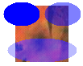

# Drawing with Opaque and Semitransparent Brushes

When you fill a shape, you must pass the address of a [**Brush**](-gdiplus-class-brush-class.md) object to one of the fill methods of the [**Graphics**](-gdiplus-class-graphics-class.md) class. The one parameter of the [**SolidBrush**](-gdiplus-class-solidbrush-class.md) constructor is a [**Color**](-gdiplus-class-color-class.md) object. To fill an opaque shape, set the alpha component of the color to 255. To fill a semitransparent shape, set the alpha component to any value from 1 through 254.

When you fill a semitransparent shape, the color of the shape is blended with the colors of the background. The alpha component specifies how the shape and background colors are mixed; alpha values near 0 place more weight on the background colors, and alpha values near 255 place more weigh on the shape color.

The following example draws an image and then fills three ellipses that overlap the image. The first ellipse uses an alpha component of 255, so it is opaque. The second and third ellipses use an alpha component of 128, so they are semitransparent; you can see the background image through the ellipses. The call to [**Graphics::SetCompositingQuality**](-gdiplus-class-graphics-setcompositingquality-compositingquality-.md) causes the blending for the third ellipse to be done in conjunction with gamma correction.


```
Image image(L"Texture1.jpg");
graphics.DrawImage(&amp;image, 50, 50, image.GetWidth(), image.GetHeight());
SolidBrush opaqueBrush(Color(255, 0, 0, 255));
SolidBrush semiTransBrush(Color(128, 0, 0, 255));
graphics.FillEllipse(&amp;opaqueBrush, 35, 45, 45, 30);
graphics.FillEllipse(&amp;semiTransBrush, 86, 45, 45, 30);
graphics.SetCompositingQuality(CompositingQualityGammaCorrected);
graphics.FillEllipse(&amp;semiTransBrush, 40, 90, 86, 30);
```


The following illustration shows the output of the preceding code.



 

 


