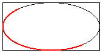

# Ellipses and Arcs

An ellipse is specified by its bounding rectangle. The following illustration shows an ellipse along with its bounding rectangle.


To draw an ellipse, you need a [**Graphics**](/windows/desktop/api/gdiplusgraphics/nl-gdiplusgraphics-graphics) object and a [**Pen**](/windows/desktop/api/gdipluspen/nl-gdipluspen-pen) object. The **Graphics** object provides the [DrawEllipse](/windows/win32/api/gdiplusgraphics/nf-gdiplusgraphics-graphics-drawellipse(inconstpen_inconstrect_)) method, and the **Pen** object stores attributes of the ellipse, such as line width and color. The address of the **Pen** object is passed as one of the arguments to the DrawEllipse method. The remaining arguments passed to the DrawEllipse method specify the bounding rectangle for the ellipse. The following example draws an ellipse; the bounding rectangle has a width of 160, a height of 80, and an upper-left corner of (100, 50).


```
myGraphics.DrawEllipse(&myPen, 100, 50, 160, 80);
```


[DrawEllipse](/windows/win32/api/gdiplusgraphics/nf-gdiplusgraphics-graphics-drawellipse(inconstpen_inconstrect_)) is an overloaded method of the [**Graphics**](/windows/desktop/api/gdiplusgraphics/nl-gdiplusgraphics-graphics) class, so there are several ways you can supply it with arguments. For example, you can construct a [**Rect**](/windows/desktop/api/gdiplustypes/nl-gdiplustypes-rect) object and pass a reference to the **Rect** object as an argument to the DrawEllipse method.


```
Rect myRect(100, 50, 160, 80);
myGraphics.DrawEllipse(&myPen, myRect);
```


An arc is a portion of an ellipse. To draw an arc, you call the [DrawArc](/windows/win32/api/gdiplusgraphics/nf-gdiplusgraphics-graphics-drawarc(inconstpen_inint_inint_inint_inint_inreal_inreal)) method of the [**Graphics**](/windows/desktop/api/gdiplusgraphics/nl-gdiplusgraphics-graphics) class. The parameters of the DrawArc method are the same as the parameters of the [DrawEllipse](/windows/win32/api/gdiplusgraphics/nf-gdiplusgraphics-graphics-drawellipse(inconstpen_inconstrect_)) method, except that DrawArc requires a starting angle and sweep angle. The following example draws an arc with a starting angle of 30 degrees and a sweep angle of 180 degrees.


```
myGraphics.DrawArc(&myPen, 100, 50, 160, 80, 30, 180);
```


The following illustration shows the arc, the ellipse, and the bounding rectangle.



 

 


