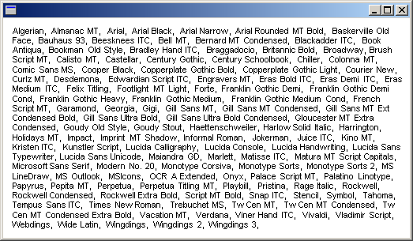

# Enumerating Installed Fonts

The [**InstalledFontCollection**](-gdiplus-class-installedfontcollection-class.md) class inherits from the [**FontCollection**](-gdiplus-class-fontcollection-class.md) abstract base class. You can use an **InstalledFontCollection** object to enumerate the fonts installed on the computer. The [**FontCollection::GetFamilies**](-gdiplus-class-fontcollection-getfamilies-numsought-gpfamilies-numfound-.md) method of an **InstalledFontCollection** object returns an array of [**FontFamily**](-gdiplus-class-fontfamily-class.md) objects. Before you call **FontCollection::GetFamilies**, you must allocate a buffer large enough to hold that array. To determine the size of the required buffer, call the [**FontCollection::GetFamilyCount**](-gdiplus-class-fontcollection-getfamilycount-.md) method and multiply the return value by **sizeof**(**FontFamily**).

The following example lists the names of all the font families installed on the computer. The code retrieves the font family names by calling the [**FontFamily::GetFamilyName**](-gdiplus-class-fontfamily-getfamilyname-name-language-.md) method of each [**FontFamily**](-gdiplus-class-fontfamily-class.md) object in the array returned by [**FontCollection::GetFamilies**](-gdiplus-class-fontcollection-getfamilies-numsought-gpfamilies-numfound-.md). As the family names are retrieved, they are concatenated to form a comma-separated list. Then the [DrawString](-gdiplus-class-graphics-drawstring-methods.md) method of the [**Graphics**](-gdiplus-class-graphics-class.md) class draws the comma-separated list in a rectangle.


```
FontFamily   fontFamily(L"Arial");
Font         font(&amp;fontFamily, 8, FontStyleRegular, UnitPoint);
RectF        rectF(10.0f, 10.0f, 500.0f, 500.0f);
SolidBrush   solidBrush(Color(255, 0, 0, 0));

INT          count = 0;
INT          found = 0;
WCHAR        familyName[LF_FACESIZE];  // enough space for one family name
WCHAR*       familyList = NULL;
FontFamily*  pFontFamily = NULL;

InstalledFontCollection installedFontCollection;

// How many font families are installed?
count = installedFontCollection.GetFamilyCount();

// Allocate a buffer to hold the array of FontFamily
// objects returned by GetFamilies.
pFontFamily = new FontFamily[count];

// Get the array of FontFamily objects.
installedFontCollection.GetFamilies(count, pFontFamily, &amp;found);

// The loop below creates a large string that is a comma-separated
// list of all font family names.
// Allocate a buffer large enough to hold that string.
familyList = new WCHAR[count*(sizeof(familyName)+ 3)];
StringCchCopy(familyList, 1, L"");

for(INT j = 0; j < count; ++j)
{
   pFontFamily[j].GetFamilyName(familyName);  
   StringCchCatW(familyList, count*(sizeof(familyName)+ 3), familyName);
   StringCchCatW(familyList, count*(sizeof(familyName)+ 3), L",  ");
}

// Draw the large string (list of all families) in a rectangle.
graphics.DrawString(
   familyList, -1, &amp;font, rectF, NULL, &amp;solidBrush);

delete [] pFontFamily;
delete [] familyList;
            
```


The following illustration shows a possible output of the preceding code. If you run the code, the output might be different, depending on the fonts installed on your computer.



 

 


