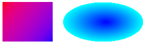

# Filling a Shape with a Color Gradient

You can fill a shape with a gradually changing color by using a gradient brush. Windows GDI+ provides linear gradient brushes and path gradient brushes. The following illustration shows a rectangle filled with a linear gradient brush and an ellipse filled with a path gradient brush.

For more information about gradient brushes, see [Filling Shapes With a Gradient Brush](-gdiplus-filling-shapes-with-a-gradient-brush-use.md).

 

 

