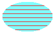

# Filling a Shape with a Hatch Pattern

A hatch pattern is made from two colors: one for the background and one for the lines that form the pattern over the background. To fill a closed shape with a hatch pattern, use a [**HatchBrush**](/windows/desktop/api/gdiplusbrush/nl-gdiplusbrush-hatchbrush) object. The following example demonstrates how to fill an ellipse with a hatch pattern:


```
HatchBrush hBrush(HatchStyleHorizontal, Color(255, 255, 0, 0),
   Color(255, 128, 255, 255));
stat = graphics.FillEllipse(&hBrush, 0, 0, 100, 60);
```


The following illustration shows the filled ellipse.



The [**HatchBrush**](/windows/desktop/api/gdiplusbrush/nl-gdiplusbrush-hatchbrush) constructor takes three arguments: the hatch style, the color of the hatch line, and the color of the background. The hatch style argument can be any element of the [**HatchStyle**](/windows/desktop/api/Gdiplusenums/ne-gdiplusenums-hatchstyle) enumeration. There are more than fifty elements in the **HatchStyle** enumeration; a few of those elements are shown in the following list:

-   **HatchStyleHorizontal**
-   **HatchStyleVertical**
-   **HatchStyleForwardDiagonal**
-   **HatchStyleBackwardDiagonal**
-   **HatchStyleCross**
-   **HatchStyleDiagonalCross**

 

 


