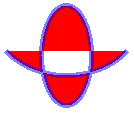

# Filling Open Figures

You can fill a path by passing the address of a [**GraphicsPath**](/windows/desktop/api/gdipluspath/nl-gdipluspath-graphicspath) object to the [**Graphics::FillPath**](/windows/desktop/api/Gdiplusgraphics/nf-gdiplusgraphics-graphics-fillpath) method. The **Graphics::FillPath** method fills the path according to the fill mode (alternate or winding) currently set for the path. If the path has any open figures, the path is filled as if those figures were closed. GDI+ closes a figure by drawing a straight line from its ending point to its starting point.

The following example creates a path that has one open figure (an arc) and one closed figure (an ellipse). The [**Graphics::FillPath**](/windows/desktop/api/Gdiplusgraphics/nf-gdiplusgraphics-graphics-fillpath) method fills the path according to the default fill mode, which is FillModeAlternate.


```
GraphicsPath path;

// Add an open figure.
path.AddArc(0, 0, 150, 120, 30, 120);

// Add an intrinsically closed figure.
path.AddEllipse(50, 50, 50, 100);

Pen pen(Color(128, 0, 0, 255), 5);
SolidBrush brush(Color(255, 255, 0, 0));

// The fill mode is FillModeAlternate by default.
graphics.FillPath(&brush, &path);
graphics.DrawPath(&pen, &path);
```


The following illustration shows the output of the preceding code. Note that path is filled (according to FillModeAlternate) as if the open figure were closed by a straight line from its ending point to its starting point.



 

 


