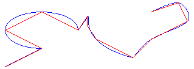

# Flattening Paths

A [**GraphicsPath**](/windows/desktop/api/gdipluspath/nl-gdipluspath-graphicspath) object stores a sequence of lines and Bézier splines. You can add several types of curves (ellipses, arcs, cardinal splines) to a path, but each curve is converted to a Bézier spline before it is stored in the path. Flattening a path consists of converting each Bézier spline in the path to a sequence of straight lines.

To flatten a path, call the [**GraphicsPath::Flatten**](/windows/desktop/api/Gdipluspath/nf-gdipluspath-graphicspath-flatten) method of a [**GraphicsPath**](/windows/desktop/api/gdipluspath/nl-gdipluspath-graphicspath) object. The **GraphicsPath::Flatten** method receives a flatness argument that specifies the maximum distance between the flattened path and the original path. The following illustration shows a path before and after flattening.

 

 

