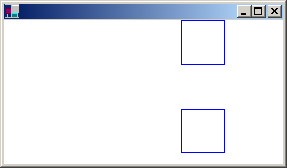
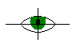
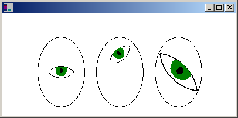

# Graphics Containers

Graphics state — clipping region, transformations, and quality settings — is stored in a [**Graphics**](/windows/win32/api/gdiplusgraphics/nl-gdiplusgraphics-graphics) object. Windows GDI+ allows you to temporarily replace or augment part of the state in a **Graphics** object by using a container. You start a container by calling the [**Graphics::BeginContainer**](/windows/win32/api/gdiplusgraphics/nf-gdiplusgraphics-graphics-begincontainer(inconstrectf__inconstrectf__inunit)) method of a **Graphics** object, and you end a container by calling the [**Graphics::EndContainer**](/windows/win32/api/Gdiplusgraphics/nf-gdiplusgraphics-graphics-endcontainer) method. In between **Graphics::BeginContainer** and **Graphics::EndContainer**, any state changes you make to the **Graphics** object belong to the container and do not overwrite the existing state of the **Graphics** object.

The following example creates a container within a [**Graphics**](/windows/win32/api/gdiplusgraphics/nl-gdiplusgraphics-graphics) object. The world transformation of the **Graphics** object is a translation 200 units to the right, and the world transformation of the container is a translation 100 units down.


```
myGraphics.TranslateTransform(200.0f, 0.0f);

myGraphicsContainer = myGraphics.BeginContainer();
   myGraphics.TranslateTransform(0.0f, 100.0f);
   myGraphics.DrawRectangle(&myPen, 0, 0, 50, 50);
myGraphics.EndContainer(myGraphicsContainer);

myGraphics.DrawRectangle(&myPen, 0, 0, 50, 50);
```


Note that in the previous example, the statement `myGraphics.DrawRectangle(&myPen, 0, 0, 50, 50)` made in between the calls to [**Graphics::BeginContainer**](/windows/win32/api/gdiplusgraphics/nf-gdiplusgraphics-graphics-begincontainer(inconstrectf__inconstrectf__inunit)) and [**Graphics::EndContainer**](/windows/win32/api/Gdiplusgraphics/nf-gdiplusgraphics-graphics-endcontainer) produces a different rectangle than the same statement made after the call to **Graphics::EndContainer**. Only the horizontal translation applies to the **DrawRectangle** call made outside of the container. Both transformations — the horizontal translation of 200 units and the vertical translation of 100 units — apply to the [**Graphics::DrawRectangle**](/windows/win32/api/gdiplusgraphics/nf-gdiplusgraphics-graphics-drawrectangle(inconstpen_inint_inint_inint_inint)) call made inside the container. The following illustration shows the two rectangles.



Containers can be nested within containers. The following example creates a container within a [**Graphics**](/windows/win32/api/gdiplusgraphics/nl-gdiplusgraphics-graphics) object and another container within the first container. The world transformation of the **Graphics** object is a translation 100 units in the x direction and 80 units in the y direction. The world transformation of the first container is a 30-degree rotation. The world transformation of the second container is a scaling by a factor of 2 in the x direction. A call to the [**Graphics::DrawEllipse**](/windows/win32/api/gdiplusgraphics/nf-gdiplusgraphics-graphics-drawellipse(inconstpen_inint_inint_inint_inint)) method is made inside the second container.


```
myGraphics.TranslateTransform(100.0f, 80.0f, MatrixOrderAppend);

container1 = myGraphics.BeginContainer();
   myGraphics.RotateTransform(30.0f, MatrixOrderAppend);

   container2 = myGraphics.BeginContainer();
      myGraphics.ScaleTransform(2.0f, 1.0f);
      myGraphics.DrawEllipse(&myPen, -30, -20, 60, 40);
   myGraphics.EndContainer(container2);

myGraphics.EndContainer(container1);
```


The following illustration shows the ellipse.


Note that all three transformations apply to the [**Graphics::DrawEllipse**](/windows/win32/api/gdiplusgraphics/nf-gdiplusgraphics-graphics-drawellipse(inconstpen_inint_inint_inint_inint)) call made in the second (innermost) container. Also note the order of the transformations: first scale, then rotate, then translate. The innermost transformation is applied first, and the outermost transformation is applied last.

Any property of a [**Graphics**](/windows/win32/api/gdiplusgraphics/nl-gdiplusgraphics-graphics) object can be set inside a container (in between calls to [**Graphics::BeginContainer**](/windows/win32/api/gdiplusgraphics/nf-gdiplusgraphics-graphics-begincontainer(inconstrectf__inconstrectf__inunit)) and [**Graphics::EndContainer**](/windows/win32/api/Gdiplusgraphics/nf-gdiplusgraphics-graphics-endcontainer)). For example, a clipping region can be set inside a container. Any drawing done inside the container will be restricted to the clipping region of that container and will also be restricted to the clipping regions of any outer containers and the clipping region of the **Graphics** object itself.

The properties discussed so far — the world transformation and the clipping region — are combined by nested containers. Other properties are temporarily replaced by a nested container. For example, if you set the smoothing mode to SmoothingModeAntiAlias within a container, any drawing methods called inside that container will use the antialias smoothing mode, but drawing methods called after [**Graphics::EndContainer**](/windows/win32/api/Gdiplusgraphics/nf-gdiplusgraphics-graphics-endcontainer) will use the smoothing mode that was in place before the call to [**Graphics::BeginContainer**](/windows/win32/api/gdiplusgraphics/nf-gdiplusgraphics-graphics-begincontainer(inconstrectf__inconstrectf__inunit)).

For another example of combining the world transformations of a [**Graphics**](/windows/win32/api/gdiplusgraphics/nl-gdiplusgraphics-graphics) object and a container, suppose you want to draw an eye and place it at various locations on a sequence of faces. The following example draws an eye centered at the origin of the coordinate system.


```
void DrawEye(Graphics* pGraphics)
{
   GraphicsContainer eyeContainer;
   
   eyeContainer = pGraphics->BeginContainer();

      Pen myBlackPen(Color(255, 0, 0, 0));
      SolidBrush myGreenBrush(Color(255, 0, 128, 0));
      SolidBrush myBlackBrush(Color(255, 0, 0, 0));

      GraphicsPath myTopPath;
      myTopPath.AddEllipse(-30, -50, 60, 60);

      GraphicsPath myBottomPath;
      myBottomPath.AddEllipse(-30, -10, 60, 60);

      Region myTopRegion(&myTopPath);
      Region myBottomRegion(&myBottomPath);

      // Draw the outline of the eye.
      // The outline of the eye consists of two ellipses.
      // The top ellipse is clipped by the bottom ellipse, and
      // the bottom ellipse is clipped by the top ellipse.
      pGraphics->SetClip(&myTopRegion);
      pGraphics->DrawPath(&myBlackPen, &myBottomPath);
      pGraphics->SetClip(&myBottomRegion);
      pGraphics->DrawPath(&myBlackPen, &myTopPath);

      // Fill the iris.
      // The iris is clipped by the bottom ellipse.
      pGraphics->FillEllipse(&myGreenBrush, -10, -15, 20, 22);

      // Fill the pupil.
      pGraphics->FillEllipse(&myBlackBrush, -3, -7, 6, 9);

   pGraphics->EndContainer(eyeContainer);
}
```


The following illustration shows the eye and the coordinate axes.



The DrawEye function, defined in the previous example receives the address of a [**Graphics**](/windows/win32/api/gdiplusgraphics/nl-gdiplusgraphics-graphics) object and immediately creates a container within that **Graphics** object. This container insulates any code that calls the DrawEye function from property settings made during the execution of the DrawEye function. For example, code in the DrawEye function sets the clipping region of the **Graphics** object, but when DrawEye returns control to the calling routine, the clipping region will be as it was before the call to DrawEye.

The following example draws three ellipses (faces), each with an eye inside.


```
// Draw an ellipse with center at (100, 100).
myGraphics.TranslateTransform(100.0f, 100.0f);
myGraphics.DrawEllipse(&myBlackPen, -40, -60, 80, 120);

// Draw the eye at the center of the ellipse.
DrawEye(&myGraphics);

// Draw an ellipse with center at 200, 100.
myGraphics.TranslateTransform(100.0f, 0.0f, MatrixOrderAppend);
myGraphics.DrawEllipse(&myBlackPen, -40, -60, 80, 120);

// Rotate the eye 40 degrees, and draw it 30 units above
// the center of the ellipse.
myGraphicsContainer = myGraphics.BeginContainer();
   myGraphics.RotateTransform(-40.0f);
   myGraphics.TranslateTransform(0.0f, -30.0f, MatrixOrderAppend);
   DrawEye(&myGraphics);
myGraphics.EndContainer(myGraphicsContainer);

// Draw a ellipse with center at (300.0f, 100.0f).
myGraphics.TranslateTransform(100.0f, 0.0f, MatrixOrderAppend);
myGraphics.DrawEllipse(&myBlackPen, -40, -60, 80, 120);

// Stretch and rotate the eye, and draw it at the 
// center of the ellipse.
myGraphicsContainer = myGraphics.BeginContainer();
   myGraphics.ScaleTransform(2.0f, 1.5f);
   myGraphics.RotateTransform(45.0f, MatrixOrderAppend);
   DrawEye(&myGraphics);
myGraphics.EndContainer(myGraphicsContainer);
```


The following illustration shows the three ellipses.



In the previous example, all ellipses are drawn with the call `DrawEllipse(&myBlackPen, -40, -60, 80, 120)`, which draws an ellipse centered at the origin of the coordinate system. The ellipses are moved away from the upper-left corner of the client area by setting the world transformation of the [**Graphics**](/windows/win32/api/gdiplusgraphics/nl-gdiplusgraphics-graphics) object. The statement causes the first ellipse to be centered at (100, 100). The statement causes the center of the second ellipse to be 100 units to the right of the center of the first ellipse. Likewise, the center of the third ellipse is 100 units to the right of the center of the second ellipse.

The containers in the previous example are used to transform the eye relative to the center of a given ellipse. The first eye is drawn at the center of the ellipse with no transformation, so the DrawEye call is not inside a container. The second eye is rotated 40 degrees and drawn 30 units above the center of the ellipse, so the DrawEye function and the methods that set the transformation are called inside a container. The third eye is stretched and rotated and drawn at the center of the ellipse. As with the second eye, the DrawEye function and the methods that set the transformation are called inside a container.

 

 
