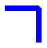

# Joining Lines

A line join is the common area that is formed by two lines whose ends meet or overlap. Windows GDI+ provides four line join styles: miter, bevel, round, and miter clipped. Line join style is a property of the [**Pen**](/windows/desktop/api/gdipluspen/nl-gdipluspen-pen) class. When you specify a line join style for a pen and then use that pen to draw a path, the specified join style is applied to all the connected lines in the path.

You can specify the line join style by using the [**Pen::SetLineJoin**](/windows/desktop/api/Gdipluspen/nf-gdipluspen-pen-setlinejoin) method of the [**Pen**](/windows/desktop/api/gdipluspen/nl-gdipluspen-pen) class. The following example demonstrates a beveled line join between a horizontal line and a vertical line:


```
GraphicsPath path;
Pen penJoin(Color(255, 0, 0, 255), 8);

path.StartFigure();
path.AddLine(Point(50, 200), Point(100, 200));
path.AddLine(Point(100, 200), Point(100, 250));

penJoin.SetLineJoin(LineJoinBevel);
graphics.DrawPath(&penJoin, &path);
```


The following illustration shows the resulting beveled line join.



In the preceding example, the value (**LineJoinBevel**) passed to the [**Pen::SetLineJoin**](/windows/desktop/api/Gdipluspen/nf-gdipluspen-pen-setlinejoin) method is an element of the [**LineJoin**](/windows/desktop/api/Gdiplusenums/ne-gdiplusenums-linejoin) enumeration.

 

 


