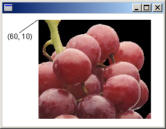

# Loading and displaying bitmaps

Also see the [WIC Viewer GDI+ sample app](https://github.com/microsoft/Windows-classic-samples/tree/master/Samples/Win7Samples/multimedia/wic/wicviewergdiplus).

To display a raster image (bitmap) on the screen, you need an [**Image**](/windows/desktop/api/gdiplusheaders/nl-gdiplusheaders-image) object and a [**Graphics**](/windows/desktop/api/gdiplusgraphics/nl-gdiplusgraphics-graphics) object. Pass the name of a file (or a pointer to a stream) to an **Image** constructor. After you have created an **Image** object, pass the address of that **Image** object to the **DrawImage** method of a **Graphics** object.

The following example creates an [**Image**](/windows/desktop/api/gdiplusheaders/nl-gdiplusheaders-image) object from a JPEG file and then draws the image with its upper-left corner at (60, 10):

```cpp
Image image(L"Grapes.jpg");
graphics.DrawImage(&image, 60, 10);
```

The following illustration shows the image drawn at the specified location.



The [**Image**](/windows/desktop/api/gdiplusheaders/nl-gdiplusheaders-image) class provides basic methods for loading and displaying raster images and vector images. The [**Bitmap**](/windows/desktop/api/gdiplusheaders/nl-gdiplusheaders-bitmap) class, which inherits from the **Image** class, provides more specialized methods for loading, displaying, and manipulating raster images. For example, you can construct a **Bitmap** object from an icon handle (HICON).

The following example obtains a handle to an icon and then uses that handle to construct a [**Bitmap**](/windows/desktop/api/gdiplusheaders/nl-gdiplusheaders-bitmap) object. The code displays the icon by passing the address of the **Bitmap** object to the **DrawImage** method of a [**Graphics**](/windows/desktop/api/gdiplusgraphics/nl-gdiplusgraphics-graphics) object.

```cpp
HICON hIcon = LoadIcon(NULL, IDI_APPLICATION);
Bitmap bitmap(hIcon);
graphics.DrawImage(&bitmap, 10, 10);
```

## See also

[WIC Viewer GDI+ sample app](https://github.com/microsoft/Windows-classic-samples/tree/master/Samples/Win7Samples/multimedia/wic/wicviewergdiplus)
