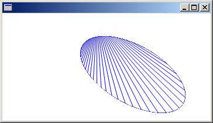

# Metafiles (GDI+)

Windows GDI+ provides the [**Metafile**](/windows/desktop/api/gdiplusheaders/nl-gdiplusheaders-metafile) class so that you can record and display metafiles. A metafile, also called a vector image, is an image that is stored as a sequence of drawing commands and settings. The commands and settings recorded in a **Metafile** object can be stored in memory or saved to a file or stream.

GDI+ can display metafiles that have been stored in the following formats:

-   Windows Metafile Format (WMF)
-   Enhanced Metafile (EMF)
-   EMF+

GDI+ can record metafiles in the EMF and EMF+ formats, but not in the WMF format.

EMF+ is an extension to EMF that allows GDI+ records to be stored. There are two variations on the EMF+ format: EMF+ Only and EMF+ Dual. EMF+ Only metafiles contain only GDI+ records. Such metafiles can be displayed by GDI+ but not by Windows Graphics Device Interface (GDI). EMF+ Dual metafiles contain GDI+ and GDI records. Each GDI+ record in an EMF+ Dual metafile is paired with an alternate GDI record. Such metafiles can be displayed by GDI+ or by GDI.

The following example records one setting and one drawing command in a disk file. Note that the example creates a [**Graphics**](/windows/desktop/api/gdiplusgraphics/nl-gdiplusgraphics-graphics) object and that the constructor for the **Graphics** object receives the address of a [**Metafile**](/windows/desktop/api/gdiplusheaders/nl-gdiplusheaders-metafile) object as an argument.


```
myMetafile = new Metafile(L"MyDiskFile.emf", hdc);
myGraphics = new Graphics(myMetafile);
   myPen = new Pen(Color(255, 0, 0, 200));
   myGraphics->SetSmoothingMode(SmoothingModeAntiAlias);
   myGraphics->DrawLine(myPen, 0, 0, 60, 40);
delete myGraphics;
delete myPen;
delete myMetafile;
```


As the preceding example shows, the [**Graphics**](/windows/desktop/api/gdiplusgraphics/nl-gdiplusgraphics-graphics) class is the key to recording instructions and settings in a [**Metafile**](/windows/desktop/api/gdiplusheaders/nl-gdiplusheaders-metafile) object. Any call made to a method of a **Graphics** object can be recorded in a **Metafile** object. Likewise, you can set any property of a **Graphics** object and record that setting in a **Metafile** object. The recording ends when the **Graphics** object is deleted or goes out of scope.

The following example displays the metafile created in the preceding example. The metafile is displayed with its upper-left corner at (100, 100).


```
Graphics myGraphics(hdc);
Image myImage(L"MyDiskFile.emf");
myGraphics.DrawImage(&myImage, 100, 100);
```


The following example records several property settings (clipping region, world transformation, and smoothing mode) in a [**Metafile**](/windows/desktop/api/gdiplusheaders/nl-gdiplusheaders-metafile) object. Then the code records several drawing instructions. The instructions and settings are saved in a disk file.


```
myMetafile = new Metafile(L"MyDiskFile2.emf", hdc); 
myGraphics = new Graphics(myMetafile);
   myGraphics->SetSmoothingMode(SmoothingModeAntiAlias);
   myGraphics->RotateTransform(30);

   // Create an elliptical clipping region.
   GraphicsPath myPath;
   myPath.AddEllipse(0, 0, 200, 100);
   Region myRegion(&myPath);
   myGraphics->SetClip(&myRegion);

   Pen myPen(Color(255, 0, 0, 255));
   myGraphics->DrawPath(&myPen, &myPath);

   for(INT j = 0; j <= 300; j += 10)
   {
      myGraphics->DrawLine(&myPen, 0, 0, 300 - j, j);
   }
delete myGraphics;
delete myMetafile;
```


The following example displays the metafile image created in the preceding example.


```
myGraphics = new Graphics(hdc);
myMetafile = new Metafile(L"MyDiskFile.emf");
myGraphics->DrawImage(myMetafile, 10, 10);
```


The following illustration shows the output of the preceding code. Note the antialiasing, the elliptical clipping region, and the 30-degree rotation.



 

 


