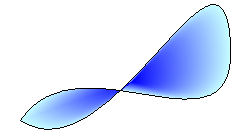
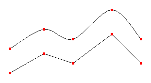
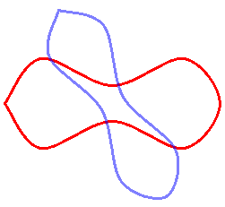
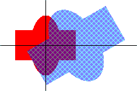
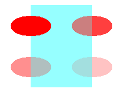

# New Features

The following sections describe several of the new features in Windows GDI+.

-   [Gradient Brushes](#gradient-brushes)
-   [Cardinal Splines](#cardinal-splines)
-   [Independent Path Objects](#independent-path-objects)
-   [Transformations and the Matrix Object](#transformations-and-the-matrix-object)
-   [Scalable Regions](#scalable-regions)
-   [Alpha Blending](#alpha-blending)
-   [Support for Multiple Image Formats](#support-for-multiple-image-formats)

## Gradient Brushes

GDI+ expands on Windows Graphics Device Interface (GDI) by providing linear gradient and path gradient brushes for filling shapes, paths, and regions. Gradient brushes can also be used to draw lines, curves, and paths. When you fill a shape with a linear gradient brush, the color gradually changes as you move across the shape. For example, suppose you create a horizontal gradient brush by specifying blue at the left edge of a shape and green at the right edge. When you fill that shape with the horizontal gradient brush, it will gradually change from blue to green as you move from its left edge to its right edge. Similarly, a shape filled with a vertical gradient brush will change color as you move from top to bottom. The following illustration shows an ellipse filled with a horizontal gradient brush and a region filled with a diagonal gradient brush.

When you fill a shape with a path gradient brush, you have a variety of options for specifying how the colors change as you move from one portion of the shape to another. One option is to have a center color and a boundary color so that the pixels change gradually from one color to the other as you move from the middle of the shape towards the outer edges. The following illustration shows a path (created from a pair of Bézier splines) filled with a path gradient brush.

## Cardinal Splines

GDI+ supports cardinal splines, which are not supported in GDI. A cardinal spline is a sequence of individual curves joined to form a larger curve. The spline is specified by an array of points and passes through each point in that array. A cardinal spline passes smoothly (no sharp corners) through each point in the array and thus is more refined than a path created by connecting straight lines. The following illustration shows two paths, one created by connecting straight lines and one created as a cardinal spline.

## Independent Path Objects

In GDI, a path belongs to a device context, and the path is destroyed as it is drawn. With GDI+, drawing is performed by a [**Graphics**](/windows/desktop/api/gdiplusgraphics/nl-gdiplusgraphics-graphics) object, and you can create and maintain several [**GraphicsPath**](/windows/desktop/api/gdipluspath/nl-gdipluspath-graphicspath) objects that are separate from the **Graphics** object. A **GraphicsPath** object is not destroyed by the drawing action, so you can use the same **GraphicsPath** object to draw a path several times.

## Transformations and the Matrix Object

GDI+ provides the [**Matrix**](/windows/desktop/api/gdiplusmatrix/nl-gdiplusmatrix-matrix) object, a powerful tool that makes transformations (rotations, translations, and so on) easy and flexible. A matrix object works in conjunction with the objects that are transformed. For example, a [**GraphicsPath**](/windows/desktop/api/gdipluspath/nl-gdipluspath-graphicspath) object has a [**GraphicsPath::Transform**](/windows/desktop/api/Gdipluspath/nf-gdipluspath-graphicspath-transform) method that receives the address of a **Matrix** object as an argument. A single 3×3 matrix can store one transformation or a sequence of transformations. The following illustration shows a path before and after a sequence of two transformations (first scale, then rotate).

## Scalable Regions

GDI+ expands greatly on GDI with its support for regions. In GDI, regions are stored in device coordinates, and the only transformation that can be applied to a region is a translation. GDI+ stores regions in world coordinates and allows a region to undergo any transformation (scaling, for example) that can be stored in a transformation matrix. The following illustration shows a region before and after a sequence of three transformations: scale, rotate, and translate.

## Alpha Blending

Note that in the previous figure, you can see the untransformed region (filled with red) through the transformed region (filled with a hatch brush). This is made possible by alpha blending, which is supported by GDI+. With alpha blending, you can specify the transparency of a fill color. A transparent color is blended with the background color — the more transparent you make a fill color, the more the background shows through. The following illustration shows four ellipses that are filled with the same color (red) at different transparency levels.

## Support for Multiple Image Formats

GDI+ provides the [**Image**](/windows/desktop/api/gdiplusheaders/nl-gdiplusheaders-image), [**Bitmap**](/windows/desktop/api/gdiplusheaders/nl-gdiplusheaders-bitmap), and [**Metafile**](/windows/desktop/api/gdiplusheaders/nl-gdiplusheaders-metafile) classes, which allow you to load, save and manipulate images in a variety of formats. The following formats are supported:

-   BMP
-   Graphics Interchange Format (GIF)
-   JPEG
-   Exif
-   PNG
-   TIFF
-   ICON
-   WMF
-   EMF

 

 

