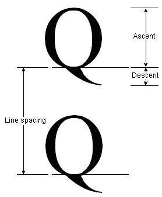
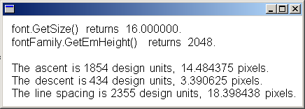
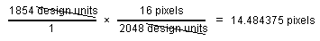

# Obtaining Font Metrics

The [**FontFamily**](/windows/desktop/api/gdiplusheaders/nl-gdiplusheaders-fontfamily) class provides the following methods that retrieve various metrics for a particular family/style combination:

-   [**FontFamily::GetEmHeight**](/windows/desktop/api/Gdiplusheaders/nf-gdiplusheaders-fontfamily-getemheight)(FontStyle)
-   [**FontFamily::GetCellAscent**](/windows/desktop/api/Gdiplusheaders/nf-gdiplusheaders-fontfamily-getcellascent)(FontStyle)
-   [**FontFamily::GetCellDescent**](/windows/desktop/api/Gdiplusheaders/nf-gdiplusheaders-fontfamily-getcelldescent)(FontStyle)
-   [**FontFamily::GetLineSpacing**](/windows/desktop/api/Gdiplusheaders/nf-gdiplusheaders-fontfamily-getlinespacing)(FontStyle)

The numbers returned by these methods are in font design units, so they are independent of the size and units of a particular [**Font**](/windows/desktop/api/gdiplusheaders/nl-gdiplusheaders-font) object.

The following illustration shows ascent, descent, and line spacing.



The following example displays the metrics for the regular style of the Arial font family. The code also creates a [**Font**](/windows/desktop/api/gdiplusheaders/nl-gdiplusheaders-font) object (based on the Arial family) with size 16 pixels and displays the metrics (in pixels) for that particular **Font** object.


```
#define INFO_STRING_SIZE 100  // one line of output including null terminator
WCHAR infoString[INFO_STRING_SIZE] = L"";
UINT  ascent;                 // font family ascent in design units
REAL  ascentPixel;            // ascent converted to pixels
UINT  descent;                // font family descent in design units
REAL  descentPixel;           // descent converted to pixels
UINT  lineSpacing;            // font family line spacing in design units
REAL  lineSpacingPixel;       // line spacing converted to pixels
                       
FontFamily   fontFamily(L"Arial");
Font         font(&fontFamily, 16, FontStyleRegular, UnitPixel);
PointF       pointF(10.0f, 10.0f);
SolidBrush   solidBrush(Color(255, 0, 0, 0));

// Display the font size in pixels.
StringCchPrintf(
   infoString, 
   INFO_STRING_SIZE, 
   L"font.GetSize() returns %f.", font.GetSize());

graphics.DrawString(
   infoString, -1, &font, pointF, &solidBrush);

// Move down one line.
pointF.Y += font.GetHeight(0.0);

// Display the font family em height in design units.
StringCchPrintf(
   infoString, 
   INFO_STRING_SIZE, 
   L"fontFamily.GetEmHeight() returns %d.", 
   fontFamily.GetEmHeight(FontStyleRegular));

graphics.DrawString(infoString, -1, &font, pointF, &solidBrush);

// Move down two lines.
pointF.Y += 2.0f * font.GetHeight(0.0f);

// Display the ascent in design units and pixels.
ascent = fontFamily.GetCellAscent(FontStyleRegular);

// 14.484375 = 16.0 * 1854 / 2048
ascentPixel = 
   font.GetSize() * ascent / fontFamily.GetEmHeight(FontStyleRegular);

StringCchPrintf(
   infoString,
   INFO_STRING_SIZE,
   L"The ascent is %d design units, %f pixels.",
   ascent, 
   ascentPixel);

graphics.DrawString(infoString, -1, &font, pointF, &solidBrush);

// Move down one line.
pointF.Y += font.GetHeight(0.0f);

// Display the descent in design units and pixels.
descent = fontFamily.GetCellDescent(FontStyleRegular);

// 3.390625 = 16.0 * 434 / 2048
descentPixel = 
   font.GetSize() * descent / fontFamily.GetEmHeight(FontStyleRegular);

StringCchPrintf(
   infoString, 
   INFO_STRING_SIZE,
   L"The descent is %d design units, %f pixels.",
   descent, 
   descentPixel);

graphics.DrawString(infoString, -1, &font, pointF, &solidBrush);

// Move down one line.
pointF.Y += font.GetHeight(0.0f);

// Display the line spacing in design units and pixels.
lineSpacing = fontFamily.GetLineSpacing(FontStyleRegular);

// 18.398438 = 16.0 * 2355 / 2048
lineSpacingPixel = 
   font.GetSize() * lineSpacing / fontFamily.GetEmHeight(FontStyleRegular);

StringCchPrintf(
   infoString, 
   INFO_STRING_SIZE,
   L"The line spacing is %d design units, %f pixels.",
   lineSpacing, 
   lineSpacingPixel);

graphics.DrawString(infoString, -1, &font, pointF, &solidBrush);
            
```


The following illustration shows the output of the preceding code.



Note the first two lines of output in the preceding illustration. The [**Font**](/windows/desktop/api/gdiplusheaders/nl-gdiplusheaders-font) object returns a size of 16, and the [**FontFamily**](/windows/desktop/api/gdiplusheaders/nl-gdiplusheaders-fontfamily) object returns an em height of 2,048. These two numbers (16 and 2,048) are the key to converting between font design units and the units (in this case pixels) of the **Font** object.

For example, you can convert the ascent from design units to pixels as follows:



The preceding code positions text vertically by setting the *y* data member of a [**PointF**](/windows/desktop/api/gdiplustypes/nl-gdiplustypes-pointf) object. The y-coordinate is increased by `font.GetHeight(0.0f)` for each new line of text. The [**Font::GetHeight**](/windows/win32/api/gdiplusheaders/nf-gdiplusheaders-font-getheight(inreal)) method of a [**Font**](/windows/desktop/api/gdiplusheaders/nl-gdiplusheaders-font) object returns the line spacing (in pixels) for that particular **Font** object. In this example, the number returned by **Font::GetHeight** is 18.398438. Note that this is the same as the number obtained by converting the line spacing metric to pixels.

 

 
