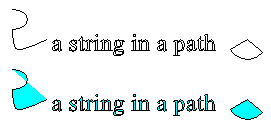

# Open and Closed Curves

The following illustration shows two curves: one open and one closed.


Closed curves have an interior and therefore can be filled with a brush. The [**Graphics**](/windows/win32/api/gdiplusgraphics/nl-gdiplusgraphics-graphics) class in Windows GDI+ provides the following methods for filling closed figures and curves: [FillRectangle](/windows/win32/api/gdiplusgraphics/nf-gdiplusgraphics-graphics-fillrectangle(constbrush_constrect_)), [FillEllipse](/windows/win32/api/gdiplusgraphics/nf-gdiplusgraphics-graphics-fillellipse(constbrush_constrect_)), [FillPie](/windows/win32/api/gdiplusgraphics/nf-gdiplusgraphics-graphics-fillpie(inconstbrush_inreal_inreal_inreal_inreal_inreal_inreal)), [FillPolygon](/windows/win32/api/gdiplusgraphics/nf-gdiplusgraphics-graphics-fillpolygon(inconstbrush_inconstpoint_inint)), [FillClosedCurve](/windows/win32/api/gdiplusgraphics/nf-gdiplusgraphics-graphics-fillclosedcurve(inconstbrush_inconstpoint_inint)), [**Graphics::FillPath**](/windows/win32/api/Gdiplusgraphics/nf-gdiplusgraphics-graphics-fillpath), and [**Graphics::FillRegion**](/windows/win32/api/Gdiplusgraphics/nf-gdiplusgraphics-graphics-fillregion). Whenever you call one of these methods, you must pass the address of one of the specific brush types ([**SolidBrush**](/windows/win32/api/gdiplusbrush/nl-gdiplusbrush-solidbrush), [**HatchBrush**](/windows/win32/api/gdiplusbrush/nl-gdiplusbrush-hatchbrush), [**TextureBrush**](/windows/win32/api/gdiplusbrush/nl-gdiplusbrush-texturebrush), [**LinearGradientBrush**](/windows/win32/api/gdiplusbrush/nl-gdiplusbrush-lineargradientbrush), or [**PathGradientBrush**](/windows/win32/api/gdipluspath/nl-gdipluspath-pathgradientbrush)) as an argument.

The [FillPie](/windows/win32/api/gdiplusgraphics/nf-gdiplusgraphics-graphics-fillpie(inconstbrush_inreal_inreal_inreal_inreal_inreal_inreal)) method is a companion to the [DrawArc](/windows/win32/api/gdiplusgraphics/nf-gdiplusgraphics-graphics-drawarc(inconstpen_inint_inint_inint_inint_inreal_inreal)) method. Just as the DrawArc method draws a portion of the outline of an ellipse, the FillPie method fills a portion of the interior of an ellipse. The following example draws an arc and fills the corresponding portion of the interior of the ellipse.


```
myGraphics.FillPie(&mySolidBrush, 0, 0, 140, 70, 0, 120);
myGraphics.DrawArc(&myPen, 0, 0, 140, 70, 0, 120);
```


The following illustration shows the arc and the filled pie.


The [FillClosedCurve](/windows/win32/api/gdiplusgraphics/nf-gdiplusgraphics-graphics-fillclosedcurve(inconstbrush_inconstpoint_inint)) method is a companion to the [DrawClosedCurve](/windows/win32/api/gdiplusgraphics/nf-gdiplusgraphics-graphics-drawclosedcurve(inconstpen_inconstpoint_inint)) method. Both methods automatically close the curve by connecting the ending point to the starting point. The following example draws a curve that passes through (0, 0), (60, 20), and (40, 50). Then, the curve is automatically closed by connecting (40, 50) to the starting point (0, 0), and the interior is filled with a solid color.


```
Point myPointArray[] =
   {Point(10, 10), Point(60, 20),Point(40, 50)};
myGraphics.DrawClosedCurve(&myPen, myPointArray, 3);
myGraphics.FillClosedCurve(&mySolidBrush, myPointArray, 3, FillModeAlternate)
```


A path can consist of several figures (subpaths). The [**Graphics::FillPath**](/windows/win32/api/Gdiplusgraphics/nf-gdiplusgraphics-graphics-fillpath) method fills the interior of each figure. If a figure is not closed, the **Graphics::FillPath** method fills the area that would be enclosed if the figure were closed. The following example draws and fills a path that consists of an arc, a cardinal spline, a string, and a pie.


```
myGraphics.FillPath(&mySolidBrush, &myGraphicsPath);
myGraphics.DrawPath(&myPen, &myGraphicsPath);
```


The following illustration shows the path before and after it is filled with a solid brush. Note that the text in the string is outlined, but not filled, by the [**Graphics::DrawPath**](/windows/win32/api/Gdiplusgraphics/nf-gdiplusgraphics-graphics-drawpath) method. It is the [**Graphics::FillPath**](/windows/win32/api/Gdiplusgraphics/nf-gdiplusgraphics-graphics-fillpath) method that paints the interiors of the characters in the string.



 

 


